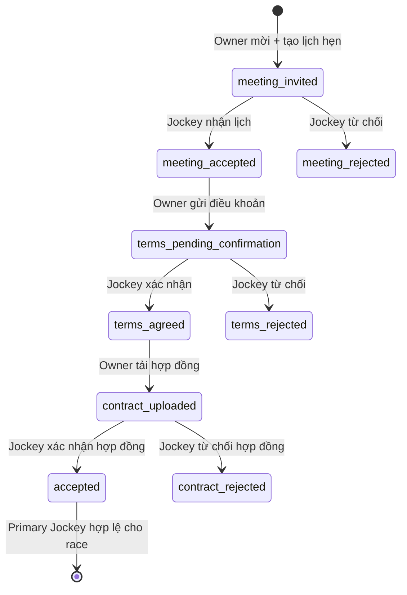

# Kịch bản demo end-to-end lúc 11:00 ngày 22/08/2026

## 1. Mục tiêu và phạm vi

Tài liệu này mô tả đầy đủ một luồng demo xuyên suốt từ lúc Horse Owner tạo ngựa đến khi Spectator nhận TOKEN thắng dự đoán và đổi quà.

Luồng chính gồm bốn bước:

1. Horse Owner tạo ngựa, đăng ký ngựa vào cuộc đua, thanh toán phí và hoàn tất thỏa thuận với Jockey.
2. Admin chốt danh sách, tạo odds và mở betting.
3. Spectator đặt dự đoán cho cuộc đua.
4. Đến ngày đua, Referee kiểm tra, bắt đầu/kết thúc cuộc đua, xử lý violation, hoàn tất báo cáo và publish kết quả. Hệ thống quyết toán bet; người thắng có đủ TOKEN có thể đổi quà.

Mốc yêu cầu tài liệu: **11:00, thứ Bảy 22/08/2026, múi giờ Asia/Ho_Chi_Minh (UTC+7)**.

Phạm vi kiểm tra trong lần chuẩn bị này:

- Đối chiếu frontend, backend, route, service, validator và dữ liệu PostgreSQL hiện có.
- Chạy test backend và production build frontend.
- Chỉ ghi nhận lỗi/rủi ro; **không sửa code và không thay đổi dữ liệu demo**.

## 2. Luồng nghiệp vụ chuẩn

```mermaid
flowchart LR
    A["T-4 ngày trở về trước\nOwner tạo ngựa"] --> B["Owner đăng ký cuộc đua"]
    B --> C["VNPay thành công\nRegistration approved + paid"]
    C --> D["Owner mời Jockey"]
    D --> E["Jockey nhận lịch hẹn"]
    E --> F["Hai bên xác nhận điều khoản"]
    F --> G["Owner tải hợp đồng"]
    G --> H["Jockey xác nhận hợp đồng\nAssignment accepted"]
    H --> I["T-3 ngày\nKhóa đăng ký"]
    I --> J["Admin finalize entries\nGenerate/review odds"]
    J --> K["Admin open betting"]
    K --> L["Spectator predict"]
    L --> M["Admin close betting"]
    M --> N["Ngày đua\nReferee pre-race checks"]
    N --> O["Referee start race"]
    O --> P["Record + resolve violations"]
    P --> Q["Referee complete race\nPost-race checks"]
    Q --> R["Submit report\nApply penalties\nFinalize results"]
    R --> S["Referee approve + publish"]
    S --> T["Settle bets\nCredit TOKEN cho người thắng"]
    T --> U["User redeem reward"]
```



Quy tắc thời gian cần thể hiện trong demo:

```text
registration_lock_at = race_date - 3 ngày (72 giờ)
```

- Đăng ký hợp lệ khi `current_time < registration_lock_at`.
- Tại đúng thời điểm khóa hoặc sau thời điểm khóa, đăng ký phải bị từ chối.
- Toàn bộ flow thỏa thuận Jockey phải hoàn tất trước khi cuộc đua bắt đầu.
- Betting phải đóng trước khi Referee bắt đầu cuộc đua.

> [!IMPORTANT]
> Code hiện tại chưa triển khai đúng mốc 72 giờ. Chi tiết nằm ở mục 14. Không dùng hành vi hiện tại `race_date - 3 giờ` để kết luận rule ba ngày đã pass.

## 3. Phân biệt các khái niệm dễ nhầm

| Khái niệm | Người nhận | Đơn vị/trạng thái | Thời điểm phát sinh |
| --- | --- | --- | --- |
| Registration approval | Horse Owner/horse entry | `approved` + `paid` | Tự động sau VNPay thành công |
| Bet payout | Spectator thắng dự đoán | TOKEN vào wallet | Khi publish kết quả và settle bet |
| Race prize award | Horse Owner và Jockey | Race prize, mặc định chia 90%/10% | Tự động calculate khi publish |
| Reward redemption | Bất kỳ user được xác thực có đủ TOKEN theo code hiện tại | Quà trong reward catalog, trạng thái ban đầu `pending` | Khi user chọn Redeem |

Trong tài liệu này, “đổi thưởng” ở cuối flow là **đổi reward bằng TOKEN**, không phải thao tác nhận `prize_award` của Owner/Jockey.

## 4. Vai trò và cửa sổ trình diễn

Nên mở năm profile trình duyệt riêng để không phải đăng xuất giữa chừng:

| Cửa sổ | Vai trò | Tài khoản demo hiện có |
| --- | --- | --- |
| A | Admin | `demo.admin@racing.test` |
| B | Horse Owner | `demo.owner1@racing.test` |
| C | Jockey | `demo.jockey1@racing.test` |
| D | Race Referee | `demo.referee1@racing.test` |
| E | Spectator | `demo.spectator@racing.test` |

Mật khẩu seed dùng chung: `Password123`.

Các tài khoản trên đã được xác nhận tồn tại và đang có trạng thái `active` trong PostgreSQL tại thời điểm kiểm tra.

## 5. Dữ liệu demo hiện tại và chiến lược trình diễn an toàn

### 5.1 Snapshot đã kiểm tra

Tại thời điểm rà soát, database có:

| Dữ liệu | Số lượng |
| --- | ---: |
| Tournament | 5 |
| Race | 15 |
| Registration | 75 |
| Jockey assignment | 75 |
| Reward item | 4 |

Wallet của `demo.spectator@racing.test` có `50,000 TOKEN`.

Reward đang active:

| Reward | Giá TOKEN | Stock |
| --- | ---: | ---: |
| Popcorn | 40 | 20 |
| VIP Tickets | 100 | 9 |
| Airpods | 999 | 10 |
| Iphone 18 Pro Max | 40,000 | 10 |

### 5.2 Hai record nên dùng nếu demo trực tiếp trong một buổi

Rule nghiệp vụ yêu cầu đăng ký trước ngày đua ít nhất ba ngày, trong khi phần Referee phải diễn ra vào ngày đua. Vì vậy không nên ép một record vừa được đăng ký lúc 11:00 lập tức chạy đua trong cùng buổi.

Nên dùng hai record có nhãn rõ ràng:

| Record | Mục đích | Gợi ý dữ liệu hiện có |
| --- | --- | --- |
| Registration Race | Bước 1: tạo ngựa, thanh toán, Jockey flow | `Race 3 - DEMO 2026 Cup 5 - Grand Finale`, 18:00 ngày 25/08/2026 |
| Live Race | Bước 2-4: odds, predict, race, violation, publish | Một race đã được chuẩn bị đầy đủ participant/check/assignment và được đặt đúng ngày demo |

Nếu bắt buộc trình diễn đúng một `race_id`, dùng **Admin > Demo timeline** ở mục 5.3 để đặt deadline/giờ đua và khóa đăng ký theo từng race. Không tự ý đổi ngày trực tiếp trong database hoặc reset database ngay trước buổi demo.

> [!WARNING]
> Không chạy `npm run seed:demo:replace` trên database dùng chung. Lệnh này gọi `TRUNCATE TABLE tournaments ... CASCADE` và xóa dữ liệu tournament phụ thuộc trước khi seed lại.

### 5.3 Cập nhật: menu `Admin > Demo timeline` cho demo một race xuyên suốt

Menu **Demo timeline** được thêm để trình diễn toàn bộ flow trên **một race đã có trạng thái `scheduled`**, không cần đổi ngày của tất cả race khác.

1. Admin chọn race và đặt riêng **Registration deadline** cùng **Race time**. Cả hai phải ở tương lai, deadline phải trước giờ đua.
2. Bấm **Open registration & apply timeline** để mở đăng ký cho đúng race đó. Nếu race đã có odds nhưng chưa có bet, odds cũ được đánh dấu `stale` để tạo lại sau khi chốt entry.
3. Horse Owner hoàn thành tạo ngựa, đăng ký/thanh toán; Jockey nhận lời mời và xác nhận hợp đồng.
4. Admin bấm **Lock registration now** cho đúng race sau khi xong Jockey flow. Không cần chờ tới deadline. Sau đó vào **Race schedule** để finalize entry, tạo odds và mở betting.
5. Spectator đặt dự đoán; Referee tiếp tục flow race/violation/publish như bình thường.

Giới hạn an toàn của menu:

- Chỉ tác động race đang `scheduled`; không reset race đã chạy hoặc đã hoàn tất.
- Không cho thay đổi timeline nếu đã có bet của Spectator.
- Không xóa registration hoặc jockey assignment đã có; nhưng trạng thái finalize/odds trước betting được reset để làm lại bước chốt entry.
- Đây là tiện ích **demo có chủ đích**, không thay thế rule nghiệp vụ 72 giờ khi nghiệm thu production.

## 6. Chuẩn bị trước 11:00

### 6.1 Khởi động hệ thống

Backend:

```powershell
cd D:\SWP-3W\HorseRacingSystem\horse-racing-backend
npm start
```

Frontend:

```powershell
cd D:\SWP-3W\HorseRacingSystem\horse-racing-frontend
npm run dev
```

URL mặc định:

```text
Backend:  http://localhost:3000
Frontend: http://localhost:5173
```

### 6.2 Checklist preflight

- [ ] PostgreSQL port `5432` mở.
- [ ] Backend `GET /` trả `200`.
- [ ] Frontend tải được trang `/login`.
- [ ] Năm tài khoản role đăng nhập được.
- [ ] VNPay sandbox mở được từ máy trình diễn.
- [ ] `VNPAY_TMN_CODE`, `VNPAY_HASH_SECRET`, `VNPAY_PAYMENT_URL`, `VNPAY_RETURN_URL` và `FRONTEND_PAYMENT_RETURN_URL` đã cấu hình.
- [ ] Registration Race còn slot và chưa tới cutoff ba ngày theo rule mong muốn.
- [ ] Live Race có ít nhất hai participant, mỗi participant có primary Jockey `accepted`.
- [ ] Referee được assign đúng Live Race.
- [ ] Spectator có TOKEN.
- [ ] Reward định đổi đang `active` và `stock > 0`.
- [ ] Chuẩn bị sẵn một file PDF/PNG hợp đồng Jockey nhỏ hơn giới hạn upload.
- [ ] Chuẩn bị sẵn một violation mẫu: `lane_violation`, severity `major`.
- [ ] Admin ghi lại `race_id`, `registration_id`, `assignment_id`, `bet_id` để xử lý dự phòng.

## 7. Timeline thuyết trình gợi ý

| Thời lượng | Nội dung |
| --- | --- |
| 00:00-02:00 | Giới thiệu actor, tournament/race và rule T-3 ngày |
| 02:00-12:00 | Bước 1A: tạo ngựa, đăng ký, VNPay, auto approval |
| 12:00-22:00 | Bước 1B: toàn bộ Jockey agreement flow |
| 22:00-28:00 | Bước 2: finalize entries, odds, open betting |
| 28:00-33:00 | Bước 3: Spectator predict và đóng betting |
| 33:00-45:00 | Bước 4: Referee controls, violation, report, publish |
| 45:00-50:00 | Bet payout, wallet và redeem reward |
| 50:00-55:00 | Negative cases và phần lỗi đang biết |

## 8. Bước 1A - Tạo ngựa, đăng ký race và thanh toán

### 8.1 Tạo ngựa

Actor: **Horse Owner**  
Màn hình: `/owner/horses/new`

Dữ liệu mẫu cho race dùng rule tuổi 4-5:

| Field | Giá trị demo |
| --- | --- |
| Name | `Demo Aurora 1100` |
| Registration number | `VN-DEMO-20260822-1100` |
| Breed | `Thoroughbred` |
| Gender | `female` |
| Date of birth | `2022-01-15` |
| Color | `Bay` |
| Weight | `470` |
| Health status | `healthy` |
| Default gears | Chọn gear hợp lệ nếu cần |
| Status | `active` |

Thao tác:

1. Đăng nhập Horse Owner.
2. Mở **Horses** > **Add horse**.
3. Nhập dữ liệu và lưu.
4. Mở lại Horse Detail để xác nhận hồ sơ.

Kết quả mong đợi:

- Ngựa được tạo và thuộc đúng owner đang đăng nhập.
- `status = active`.
- `registration_number` là duy nhất.
- Ngựa xuất hiện trong danh sách eligible nếu thỏa rule snapshot của racetrack.

Negative case nên nói, không cần phá Golden Race:

- Thiếu `name` hoặc `registration_number`: API trả validation error.
- Ngày sinh ở tương lai: bị từ chối.
- Ngựa `inactive`: không thể đăng ký.
- Ngựa không thỏa cân nặng/tuổi/breed của track: không xuất hiện trong eligible list hoặc API đăng ký trả lỗi.

### 8.2 Chọn race và kiểm tra cutoff ba ngày

Actor: **Horse Owner**  
Màn hình: `/owner/registrations`

Trước khi bấm đăng ký, presenter nói rõ:

```text
Ví dụ race bắt đầu 18:00 ngày 25/08/2026.
Cutoff đúng theo yêu cầu = 18:00 ngày 22/08/2026.
Đăng ký lúc 11:00 ngày 22/08/2026 còn hợp lệ.
Đăng ký từ 18:00 ngày 22/08/2026 trở đi phải bị chặn.
```

Điều kiện phải đạt:

- Race có `status = scheduled`.
- Registration chưa locked và chưa qua `registration_lock_at`.
- Còn slot.
- Horse thuộc owner, đang active và eligible.
- Horse chưa có registration đã paid/approved trong race đó.

### 8.3 Tạo registration và thanh toán VNPay

Thao tác:

1. Chọn tournament và race.
2. Chọn ngựa vừa tạo.
3. Kiểm tra fee, track rule và số slot còn lại.
4. Chọn gear nếu cần.
5. Xác nhận đăng ký.
6. Hệ thống tạo registration `pending`, giữ một slot và tạo order `REG-*`.
7. Trình duyệt chuyển sang VNPay sandbox.
8. Hoàn tất thanh toán thành công.
9. VNPay callback về `/api/deposit/webhook/payment` và frontend chuyển tới `/owner/payment-success`.
10. Mở lại **Registrations** để kiểm tra trạng thái.

Kết quả mong đợi:

| Thuộc tính | Giá trị |
| --- | --- |
| Registration status | `approved` |
| Payment status | `paid` |
| Slot | Vẫn được giữ cho registration |
| Approved time | Được ghi tự động |
| Admin note | Auto-confirm sau VNPay thành công |

Điểm cần nói đúng với code hiện tại:

- Owner registration **không có bước Admin duyệt thủ công riêng** sau khi VNPay thành công.
- “Thanh toán và duyệt” trong kịch bản này là thanh toán thành công dẫn tới **auto approval**.
- Payment reservation mặc định hết hạn sau 15 phút. Nếu thanh toán về sau khi reservation hết hạn, registration bị `rejected`, payment thành `refund_pending`.

### 8.4 Kiểm tra gate trước khi mời Jockey

Không chuyển sang Jockey flow cho đến khi cả hai điều kiện cùng đúng:

```text
registration.status = approved
payment_status IN (paid, not_required)
```

Nếu registration mới chỉ `pending`, API mời Jockey phải trả `409` với ý nghĩa “cần entry đã xác nhận và thanh toán đầy đủ”.

## 9. Bước 1B - Đăng ký/thỏa thuận Jockey

Actor luân phiên: **Horse Owner** và **Jockey**  
Màn hình Owner: `/owner/jockeys`  
Màn hình Jockey: `/jockey/invitations`

### 9.1 State machine chính



### 9.2 Mời Jockey và tạo lịch hẹn

Actor: **Horse Owner**

1. Chọn race slot vừa `approved + paid`.
2. Chọn Jockey đang `active`, không bị suspended và chưa binding với horse khác trong cùng race.
3. Chọn assignment type `primary`.
4. Nhập lịch hẹn offline:

| Field | Giá trị mẫu |
| --- | --- |
| Title | `Trao đổi hợp đồng Demo Aurora` |
| Meeting time | Một thời điểm trong tương lai và trước `race_date` |
| Location name | `Phu Tho Stable Office` |
| Address | `2 Le Dai Hanh, Ho Chi Minh City` |
| City | `Ho Chi Minh City` |
| Contact name | `Nguyen Minh Owner` |
| Contact phone | `0900000001` |
| Invitation message | `Mời jockey trao đổi điều khoản thi đấu.` |

5. Gửi invitation.

Kết quả: `assignment.status = meeting_invited`.

Validation cần nêu:

- Meeting time phải ở tương lai.
- Meeting time phải trước `race_date`.
- Chỉ horse có registration `approved + paid/not_required` mới mời được Jockey.
- Mỗi horse chỉ có một primary assignment active.
- Jockey không được binding với horse khác trong cùng race.

### 9.3 Jockey nhận lịch hẹn

Actor: **Jockey**

1. Mở `/jockey/invitations`.
2. Mở invitation vừa nhận.
3. Bấm **Accept appointment**.

Kết quả: `meeting_invited -> meeting_accepted` và lưu `accepted_at`.

Nhánh phụ: nếu bấm Reject thì assignment chuyển `meeting_rejected`, owner phải chọn Jockey khác hoặc tạo flow mới.

### 9.4 Owner gửi điều khoản

Actor: **Horse Owner**

1. Mở assignment đã `meeting_accepted`.
2. Nhập `agreed_terms`, ví dụ phí, giờ có mặt, trách nhiệm thiết bị và tuân thủ Referee.
3. Có thể thêm `meeting_note`.
4. Gửi cho Jockey xác nhận.

Kết quả: `meeting_accepted -> terms_pending_confirmation`.

### 9.5 Jockey xác nhận điều khoản

Actor: **Jockey**

1. Mở invitation.
2. Kiểm tra điều khoản.
3. Bấm **Confirm terms**.

Kết quả: `terms_pending_confirmation -> terms_agreed`.

Nếu Jockey reject, status thành `terms_rejected`; owner có thể cập nhật và gửi lại điều khoản.

### 9.6 Owner tải hợp đồng

Actor: **Horse Owner**

1. Chỉ thực hiện khi `status = terms_agreed`.
2. Nhập contract number và title.
3. Upload PDF/JPEG/PNG/WebP hoặc dùng URL HTTP(S).
4. Lưu hợp đồng.

Kết quả: `terms_agreed -> contract_uploaded`.

### 9.7 Jockey xác nhận hợp đồng

Actor: **Jockey**

1. Mở hợp đồng vừa upload.
2. Bấm **Confirm contract**.

Kết quả cuối:

```text
assignment_type = primary
assignment.status = accepted
```

Owner và Jockey kiểm tra `/owner/schedule` và `/jockey/schedule`; horse, Jockey và race phải khớp nhau.

### 9.8 Backup Jockey - tùy chọn

Chỉ demo khi còn thời gian:

1. Primary assignment phải `accepted` và không có cancellation request pending.
2. Owner mời một backup Jockey.
3. Backup nhận appointment.
4. Owner gửi standby terms.
5. Backup xác nhận; status thành `standby_confirmed`.

Backup không thay thế primary cho đến khi owner thực hiện promote theo flow hợp lệ.

## 10. Bước 2 - Admin tạo odds và mở betting

Actor: **Admin**  
Màn hình: `/admin/races` hoặc module Race Schedule/Betting Control

### 10.1 Kiểm tra model-input readiness

Trước khi tạo odds:

- Registration dùng cho race phải `approved`.
- Horse entry detail/rating/weight/gear cần thiết đã có.
- Mỗi horse hợp lệ có primary Jockey `accepted`.
- Không còn thay đổi participant dự kiến.

### 10.2 Finalize entries

1. Mở race.
2. Chọn **Finalize entries**.
3. Kiểm tra draw, participant snapshot và model input version.

Kết quả:

- Entries được chốt cho vòng đời odds.
- Các thay đổi ảnh hưởng model input sau đó phải làm odds stale hoặc bị chặn khi đã có bet.

### 10.3 Generate và review odds

1. Bấm **Generate odds**.
2. Kiểm tra mỗi horse có:
   - win probability;
   - fair odds;
   - game odds;
   - rank;
   - horse/Jockey snapshot.
3. Nếu cần, Admin chỉnh `game_odds` và ghi chú trước khi market mở.

Kết quả: market có `status = generated`.

Validation:

- Không được trùng horse trong bảng odds.
- Odds phải nằm trong range validator.
- Không được manual-adjust sau khi betting đã open.

### 10.4 Open betting

1. Nhập `min_stake`, `max_stake`, currency `TOKEN`.
2. Chọn `closes_at` nằm trong tương lai và trước `race_date`.
3. Bấm **Open betting**.

Kết quả mong đợi:

```text
race.betting_status = open
odds_market.status = open
```

Race xuất hiện trong `/spectator/predictions`.

## 11. Bước 3 - Spectator predict

Actor: **Spectator**  
Màn hình: `/spectator/predictions`

### 11.1 Đặt dự đoán

1. Đăng nhập `demo.spectator@racing.test`.
2. Mở race đang betting `open`.
3. Chọn horse dự đoán thắng.
4. Nhập stake trong khoảng Admin cấu hình, ví dụ `100 TOKEN`.
5. Xác nhận.

Kết quả:

- Wallet bị trừ stake đúng một lần.
- Bet có `status = pending`.
- Bet lưu odds snapshot tại thời điểm đặt.
- Potential payout được tính:

```text
potential_payout = stake_amount × accepted game_odds
```

- Dynamic odds có thể được reprice sau bet, nhưng bet cũ vẫn dùng snapshot đã chấp nhận.

### 11.2 Kiểm tra history

Mở `/spectator/predictions/history` và xác nhận:

- đúng race;
- đúng horse;
- đúng stake;
- đúng accepted odds;
- đúng potential payout;
- status `pending`.

### 11.3 Negative cases

| Case | Kết quả mong đợi |
| --- | --- |
| Stake nhỏ hơn min hoặc lớn hơn max | Bị từ chối |
| Wallet không đủ TOKEN | Bị từ chối, không tạo bet |
| Horse không có trong odds market | Bị từ chối |
| Market `closed/settled` | Bị từ chối |
| Race `running/completed/cancelled` | Bị từ chối |

### 11.4 Đóng betting

Actor: **Admin**

1. Bấm **Close betting** trước race start.
2. Refresh Spectator.
3. Thử đặt thêm một bet để minh họa validation.

Kết quả:

```text
race.betting_status = closed
odds_market.status = closed
new bet is rejected
```

Không phụ thuộc vào tự động đóng theo `closes_at` trong buổi demo hiện tại; phải đóng thủ công do lỗi scheduler/time validation ở mục 14.

## 12. Bước 4 - Ngày đua: Referee vận hành và publish

Actor: **Race Referee**  
Màn hình gốc: `/referee/races`

### 12.1 Pre-race checks

1. Mở race được assign.
2. Vào **Horse inspection** với phase `pre_race`.
3. Ghi nhận từng participant:
   - identity/registration;
   - health/fitness;
   - equipment/tack;
   - weight;
   - ballast nếu có;
   - eligibility.
4. Save đủ tất cả participant.

Điều kiện để start:

- Có participant approved.
- Mỗi participant có primary Jockey `accepted`.
- Jockey không bị suspended.
- Latest pre-race check là passed/eligible.
- Ballast bắt buộc đã được Referee xác nhận.

### 12.2 Start race

1. Mở `/referee/races/:raceId/monitor`.
2. Bấm **Start race**.

Kết quả:

- Betting được đóng lại như một safety gate.
- Registration được locked.
- Race chuyển `scheduled -> starting -> running`.
- Race Engine tạo provisional run/order.
- Spectator race detail có thể xem diễn biến 2D.

### 12.3 Ghi nhận và xử lý violation

Violation mẫu:

| Field | Giá trị |
| --- | --- |
| Type | `lane_violation` |
| Severity | `major` |
| Subject | Một horse/Jockey đang chạy |
| Description | `Lấn làn tại đoạn cua thứ hai.` |
| Evidence | URL hoặc ghi chú demo |

Flow:

1. Referee tạo during-race observation/incident.
2. Hệ thống tạo violation ở trạng thái unresolved; không auto-confirm.
3. Mở `/referee/races/:raceId/violations`.
4. Kiểm tra system recommendation.
5. Chọn **Confirm penalty** hoặc **Dismiss incident**.
6. Nếu chỉnh penalty khác recommendation, nhập deviation reason bắt buộc.

Kết quả:

- Violation phải thành `confirmed`, `resolved` hoặc `dismissed`.
- Không để `recorded/under_review` trước finalization.
- Penalty cuối cùng được snapshot vào kết quả.

### 12.4 Complete race và post-race checks

1. Bấm **Complete race**.
2. Race chuyển `running -> completed`.
3. Vào Horse Inspection phase `post_race`.
4. Ghi nhận recovery/health cho mọi participant eligible.
5. Không để horse ở trạng thái `under_investigation` nếu muốn publish ngay.

### 12.5 Báo cáo Referee

Mở `/referee/races/:raceId/closure`, tab **Report**:

1. Nhập report title.
2. Chọn race condition, weather, track condition.
3. Tóm tắt incident/violation.
4. Nhập official conclusion.
5. **Save Draft**.
6. **Submit Report**.

Kết quả: report chuyển `draft -> submitted` và bị khóa chỉnh sửa theo flow thường.

### 12.6 Readiness gate

Tab **Results** chỉ sẵn sàng khi:

- [ ] Registration locked.
- [ ] Race completed/finished.
- [ ] Có participant eligible.
- [ ] Không có participant pre-race bị block.
- [ ] Referee report đã submitted.
- [ ] Đã có post-race check cho tất cả participant eligible.
- [ ] Không có horse under investigation.
- [ ] Không còn violation unresolved.

### 12.7 Apply penalty, finalize và publish

Thứ tự thao tác:

1. **Apply Confirmed Penalties**.
2. Kiểm tra raw position/time và final position/time.
3. **Finalize Results**.
4. **Approve and Publish**.

Frontend hiện thực hiện hai API call khi bấm publish từ draft-finalized:

```text
confirm results
publish results
```

Kết quả:

- Tất cả Race Result chuyển `confirmed -> published`.
- `published_by` là Referee thực hiện thao tác.
- Horse rating được cập nhật.
- Race prize awards cho Owner/Jockey được calculate.
- Pending bets được settle.

### 12.8 Kiểm tra sau publish

Spectator:

- Race detail hiển thị official order.
- Bet history chuyển `pending -> won/lost/cancelled`.
- Bet thắng được credit `potential_payout` vào wallet đúng một lần.

Horse Owner:

- `/owner/results` hiển thị final result và owner prize share nếu có.

Jockey:

- `/jockey/results` hiển thị result, penalty liên quan và Jockey prize share nếu có.

Admin:

- Result ledger hiển thị kết quả do Referee publish.
- Dashboard/betting summary cập nhật.
- Có thể approve/mark-paid race prize award qua API/admin flow riêng nếu business yêu cầu.

## 13. Đổi reward bằng TOKEN

Actor: **Spectator/User**  
Màn hình: `/spectator/rewards`

1. Kiểm tra bet đã `won` và wallet đã nhận payout.
2. Chọn reward còn stock, ví dụ **VIP Tickets - 100 TOKEN**.
3. Bấm **Redeem**.
4. Mở redemption history.

Kết quả:

- Wallet bị trừ `token_price` đúng một lần.
- Stock reward giảm một.
- Có transaction `redeem` direction `debit`, status `completed`.
- Redemption được tạo với status ban đầu `pending`.
- Admin có thể chuyển `pending -> processing -> completed`.
- Nếu Admin cancel từ trạng thái cho phép, TOKEN được refund và stock được hoàn lại.

Validation:

- Wallet không đủ: trả lỗi insufficient balance, không trừ stock.
- Reward inactive/không tồn tại: không redeem được.
- Stock bằng 0: không redeem được.
- Nếu stock hết đúng lúc sau khi đã trừ TOKEN, service có compensating refund.

## 14. Lỗi và rủi ro phát hiện được - chỉ báo cáo, chưa sửa

### 14.1 P0 - Rule khóa đăng ký đang là ba giờ, không phải ba ngày

Yêu cầu:

```text
registration_lock_at = race_date - 72 giờ
```

Code hiện tại:

```js
const LOCK_OFFSET_MS = 3 * 60 * 60 * 1000;
```

Xuất hiện trong:

- `services/raceEngineService.js`
- `services/raceService.js`

Seed còn lệch thêm một mức: `scripts/seedFullDemo.js` đặt `registration_lock_at = race_date - 1 giờ`.

Ảnh hưởng:

- Hệ thống vẫn nhận đăng ký trong khoảng T-3 ngày đến T-3 giờ, trái rule.
- Dữ liệu seed không chứng minh được validation ba ngày.
- Demo negative case tại cutoff 72 giờ sẽ fail về mặt nghiệp vụ.

Trạng thái: **Chưa sửa theo yêu cầu của user. Đây là blocker nếu nghiệm thu bắt buộc rule T-3 ngày.**

### 14.2 P0 - Không có scheduler runtime để tự khóa registration/đóng market

`RACE_ENGINE_README.md` nói scheduler chạy mỗi phút, nhưng `bin/www` chỉ connect PostgreSQL và start HTTP server; không có `setInterval`, cron worker hoặc lời gọi `findRacesReadyForLock/processDueRace`.

Dữ liệu live xác nhận có nhiều race đã qua thời gian lock/race date nhưng vẫn:

```text
status = scheduled
registration_locked = false
betting_status = open hoặc unavailable
```

Ảnh hưởng:

- Cờ `registration_locked` không tự chuyển đúng hạn.
- Market seed có thể còn `open` sau giờ dự kiến.
- Presenter phải close betting thủ công.

Lưu ý: owner registration service vẫn so thời gian `registration_lock_at`, nên một phần đăng ký bị chặn theo timestamp; tuy nhiên state toàn hệ thống vẫn không nhất quán.

### 14.3 P0 - Place bet không kiểm tra `closes_at` hoặc `race_date`

`betService.placeBet` hiện kiểm tra:

- odds market có `status = open`;
- race chưa `running/completed/cancelled`;
- stake và wallet hợp lệ.

Service không kiểm tra:

```text
now < betting_market.closes_at
now < race.race_date
```

Khi kết hợp với việc không có scheduler, một market bị bỏ quên ở `open` có thể tiếp tục nhận bet sau giờ đóng hoặc sau giờ race dự kiến, miễn race vẫn `scheduled`.

Trạng thái: **Chưa sửa. Bắt buộc Admin close betting thủ công trước demo race.**

### 14.4 P1 - Referee/Admin có thể start race sớm

`raceService.startRace` chỉ yêu cầu race `scheduled` (hoặc stale `starting`) và participant đủ readiness; không kiểm tra current time đã tới ngày/giờ race.

Route start/complete cho phép cả `race_referee` và `admin`, trong khi kịch bản nghiệp vụ giao trách nhiệm này cho Referee.

Ảnh hưởng:

- Race có thể bị start trước lịch.
- Admin có thể vận hành race ngoài vai trò mô tả.

### 14.5 P1 - Publish vẫn trả thành công khi settle bet lỗi

Sau khi publish result, service gọi settle bet trong `try/catch`. Nếu settle lỗi:

- Result vẫn `published`.
- API publish vẫn trả response thành công kèm `bet_settlement.status = failed`.
- Bet có thể còn `pending`, winner chưa nhận TOKEN.
- Cần Admin gọi retry endpoint `/api/bets/races/:raceId/settle`.

Trong demo phải kiểm tra cả `result.status = published` **và** `bet_settlement`/Bet History, không dừng ở toast “published”.

### 14.6 P1 - Rule “chỉ người thắng mới được đổi quà” chưa được enforce

Nếu yêu cầu business thật sự là chỉ user thắng prediction mới được redeem, code hiện tại chưa kiểm tra winning bet.

`POST /api/rewards/:itemId/redeem` chỉ yêu cầu:

- user đã authenticate;
- reward active và còn stock;
- wallet có đủ TOKEN.

Do đó user nạp TOKEN hoặc nhận TOKEN từ nguồn khác vẫn redeem được. Cần product owner xác nhận đây là chủ đích hay lỗi nghiệp vụ.

### 14.7 P2 - Nội dung UI về quyền publish đang mâu thuẫn

`RefereeLayout.jsx` đang hiển thị câu “Admin confirms and publishes final results”, nhưng route/backend và màn Race Closure cho phép **Referee confirm + publish**, đúng với kịch bản mới.

Ảnh hưởng: presenter/audience có thể hiểu sai quyền hạn dù thao tác thực tế chạy bằng Referee.

### 14.8 P2 - Tài liệu demo cũ và seed hiện tại không đồng bộ

`docs/FULL_ROLE_DEMO_SCENARIO.md` chứa:

- các lệnh seed không còn tồn tại trong `package.json`;
- email cũ như `admin@racing.test`, trong khi seed hiện tại tạo `demo.admin@racing.test`;
- flow cũ nói Admin publish, trái route hiện tại là Referee publish.

Tài liệu này dùng account và flow thực tế đã kiểm tra, không dùng các lệnh seed cũ.

### 14.9 P3 - Test frontend tích hợp bị skip và bundle lớn

- Backend test: 129 test được discover, 125 pass, 4 skip, 0 fail.
- Bốn test skip vì thông báo `frontend reference project is not checked out in this workspace`.
- Frontend build pass nhưng Vite cảnh báo JS/CSS chunk lớn hơn 500 kB.

Đây không phải blocker chức năng cho demo, nhưng bốn nhánh frontend bị skip chưa được test tự động trong workspace hiện tại.

## 15. Kết quả kiểm tra kỹ thuật

### 15.1 Đã chạy

```powershell
cd horse-racing-backend
npm test
```

Kết quả:

```text
tests: 129
pass: 125
fail: 0
skipped: 4
```

```powershell
cd horse-racing-frontend
npm run build
```

Kết quả: build production thành công.

### 15.2 Đã kiểm tra read-only

- Backend port `3000`: mở, `GET /` trả `200`.
- PostgreSQL port `5432`: mở và query được.
- Frontend dev port `5173`: chưa mở tại thời điểm kiểm tra.
- Demo accounts: tồn tại, active.
- VNPay environment bắt buộc: đã cấu hình.
- Demo data/reward/wallet: tồn tại.

### 15.3 Chưa thực hiện

- Chưa chạy full E2E bằng trình duyệt qua toàn bộ VNPay sandbox.
- Chưa tạo registration/bet/violation/result mới vì yêu cầu là chỉ kiểm tra, không sửa code; đồng thời tránh mutate dữ liệu demo trước giờ trình bày.
- Chưa kiểm tra email vì SMTP chưa cấu hình trong `.env`; code cho phép registration tiếp tục nếu gửi email lỗi.
- Không dùng Docker vì máy hiện tại không có lệnh `docker` trong PATH.

## 16. Go/No-Go cho buổi demo

### Demo theo hành vi hiện tại

**Conditional Go** nếu thực hiện đủ các biện pháp:

- Dùng dữ liệu đã chuẩn bị thay vì reset database.
- Đóng betting thủ công.
- Không tuyên bố rule ba ngày đã được code enforce.
- Referee kiểm tra readiness đầy đủ trước publish.
- Sau publish phải kiểm tra Bet History/wallet; nếu settlement failed, Admin retry settle.
- Dùng reward rẻ như Popcorn/VIP Tickets để giảm rủi ro số dư/stock.

### Nghiệm thu đúng toàn bộ business rule

**No-Go** cho đến khi ít nhất các mục sau được xử lý và retest:

1. Đổi cutoff registration từ 3 giờ thành 72 giờ ở mọi nguồn tạo/cập nhật/seed.
2. Có scheduler hoặc enforce đồng bộ tại request-time để khóa registration và betting.
3. Place bet kiểm tra `closes_at` và `race_date`.
4. Xác nhận rõ winner-only redemption có phải rule bắt buộc hay không.

## 17. Checklist chốt sau demo

- [ ] Registration của ngựa mới là `approved + paid`.
- [ ] Primary Jockey assignment là `accepted`.
- [ ] Odds market đã `closed/settled`, không còn `open`.
- [ ] Race là `completed`.
- [ ] Tất cả violation đã resolved/dismissed/confirmed.
- [ ] Referee report là `submitted`.
- [ ] Race results là `published`.
- [ ] Bet là `won/lost/cancelled`, không còn `pending`.
- [ ] Winner wallet tăng đúng payout một lần.
- [ ] Redemption được tạo và wallet/stock giảm đúng.
- [ ] Ghi lại mọi API response có `bet_settlement.status = failed` để retry.
- [ ] Không chạy seed replace hoặc xóa dữ liệu sau demo nếu chưa được nhóm xác nhận.
