# Full Role Demo Scenario

## 1. Purpose

This playbook demonstrates the implemented system across all five roles:

```text
Spectator
Horse Owner
Jockey
Race Referee
Admin
```

It contains:

1. One end-to-end success flow using the same race.
2. Alternative and failure cases for each role.
3. Expected visible results after every action.
4. A recovery plan if a destructive action is selected during the demo.

The recommended presentation length is 35-45 minutes. The complete case catalog
can be used for a longer technical demonstration or question-and-answer session.

## 2. Demo Safety Rules

Use separate races for separate outcomes:

| Race label | Purpose | Must remain intact until |
| --- | --- | --- |
| Golden Race | Full registration, jockey, betting, referee, result and prize flow | End of presentation |
| Cancellation Race | Entry cancellation and refund | Owner refund confirmation |
| Inspection Failure Race | Failed/scratched pre-race check | Referee demo |
| Jockey Branch Race | Reject, withdraw, backup and promotion cases | Jockey demo |
| Closed Market Race | Betting validation cases | Spectator demo |

Do not use the Golden Race for rejection, cancellation, scratched horse, or
correction cases until its published result has been demonstrated.

Use five browser profiles or separate private windows so role switching does not
interrupt the presentation:

```text
Window A: Admin
Window B: Horse Owner
Window C: Jockey
Window D: Race Referee
Window E: Spectator
```

## 3. Environment Preparation

### 3.1 Start the applications

Backend:

```powershell
cd E:\Project\horse-racing-backend
npm start
```

Frontend:

```powershell
cd E:\Project\horse-racing-backend\_reference\Horse-Riding-Management-System
npm run dev
```

### 3.2 Prepare demo data

The full reset command deletes and rebuilds demo collections. Run it only against
the dedicated demo database:

```powershell
npm.cmd run seed:demo:reset
```

Prepare the dedicated 2D race:

```powershell
npm.cmd run seed:demo:2d-race
npm.cmd run seed:demo:2d-race-now
```

Optional focused data packs:

```powershell
npm.cmd run seed:demo:open-registration
npm.cmd run seed:demo:odds-race
npm.cmd run seed:rewards
```

### 3.3 Demo accounts

All seeded accounts use:

```text
Password123
```

| Role | Primary account | Secondary account |
| --- | --- | --- |
| Admin | `admin@racing.test` | `demo2d.admin@racing.test` |
| Horse Owner | `owner1@racing.test` | `owner2@racing.test` |
| Jockey | `jockey1@racing.test` | `jockey2@racing.test` |
| Race Referee | `referee1@racing.test` | `referee2@racing.test` |
| Spectator | `spectator1@racing.test` | `spectator2@racing.test` |

Dedicated 2D accounts:

| Role | Account |
| --- | --- |
| Admin | `demo2d.admin@racing.test` |
| Owner | `demo2d.owner@racing.test` |
| Referee | `demo2d.referee@racing.test` |
| Spectator | `demo2d.spectator@racing.test` |

### 3.4 Record the selected race data

Before presenting, fill this table from the Admin Race Schedule:

| Demo item | Selected value |
| --- | --- |
| Tournament | |
| Golden Race | |
| Golden Race referee | |
| Golden Race participant count | |
| Cancellation Race | |
| Inspection Failure Race | |
| Jockey Branch Race | |
| Closed Market Race | |

The Golden Race should have:

```text
5-6 paid and approved entries
accepted primary jockey for every eligible horse
assigned active referee
future or demo-adjusted race time
configured race prize
betting market not yet settled
```

### 3.5 Current frontend coverage

Most steps below have a dedicated frontend screen. The following implemented
operations currently require an API client or seeded state because no complete
admin screen is wired for them:

```text
Admin approve/reject a role application
Admin approve a calculated race prize award
Admin mark a race prize award as paid
```

Optional API-client endpoints:

```text
POST /api/admin/role-applications/:id/approve
POST /api/admin/role-applications/:id/reject
POST /api/prizes/races/:raceId/approve
POST /api/prizes/awards/:id/mark-paid
```

For a frontend-only presentation:

1. Use the already approved seeded operational accounts.
2. Show role application submission from the Spectator workspace, then explain
   that approval is represented by the seeded approved account.
3. Publish the race result to calculate prize awards automatically.
4. Show the calculated shares in Horse Owner and Jockey Results.

## 4. Presentation Overview

```mermaid
flowchart LR
  A["Spectator account and role application"] --> B["Admin creates race programme"]
  B --> C["Owner registers horse and pays"]
  C --> D["Owner and jockey confirm agreement"]
  D --> E["Admin prepares odds and opens betting"]
  E --> F["Spectator places a win bet"]
  F --> G["Referee completes pre-race checks"]
  G --> H["Race Engine creates the race order"]
  H --> I["Referee records incidents and post-race checks"]
  I --> J["Referee submits report and finalizes draft results"]
  J --> K["Admin publishes result and prize"]
  K --> L["Spectator bet settles and roles view results"]
```



## 5. Core End-To-End Demo

### Phase A - Authentication And Role Application

| ID | Actor | Screen | Action | Expected result |
| --- | --- | --- | --- | --- |
| AUTH-01 | New user | `/signup` | Register with name, email and password | Account is created as `spectator` |
| AUTH-02 | New user | `/verify-account` | Enter the email OTP | Account becomes verified and active |
| AUTH-03 | Spectator | `/login` | Log in with verified email | Spectator home opens |
| ROLE-01 | Spectator | Profile > Role applications | Apply for Horse Owner, Jockey or Race Referee | Application shows `pending` |
| ROLE-02 | Admin | API client or prepared seed | Approve the pending application | Requested role and profile are created |
| ROLE-03 | User | Workspace chooser | Refresh session and switch workspace | Approved role workspace becomes available |

Presenter note:

```text
Public signup never grants an operational role directly.
Admin validates the submitted licence and supporting documents first.
```

### Phase B - Admin Builds The Competition

Use the seeded Golden Race for the live flow. Create a small extra tournament only
if the audience needs to see form validation.

| ID | Actor | Screen | Action | Expected result |
| --- | --- | --- | --- | --- |
| ADM-01 | Admin | Tournaments | Create tournament with name, dates and venue | Tournament appears in the ledger |
| ADM-02 | Admin | Tournaments | Create a round inside the tournament | Round is linked to the tournament |
| ADM-03 | Admin | Race Schedule | Create race inside the round | Race appears with scheduled status |
| ADM-04 | Admin | Race form | Set race time, capacity, entry fee, distance and conditions | Race owns its fee and conditions |
| ADM-05 | Admin | Race form | Assign an active referee | Race appears in that referee's board |
| ADM-06 | Admin | Race form | Configure race prize pool | Tournament shows the sum of race prizes |
| ADM-07 | Admin | Race Schedule | Open registration for the selected race | Owner can select the race |

Expected business statement:

```text
Tournament groups races.
Entry fee, participants, odds, results and prize belong to each Race.
```

### Phase C - Horse Owner Registration And VNPay

| ID | Actor | Screen | Action | Expected result |
| --- | --- | --- | --- | --- |
| OWN-01 | Horse Owner | Horses | Create or open an active horse | Horse profile is available |
| OWN-02 | Horse Owner | Registrations | Select tournament, eligible horse and open race | Race detail and fee are displayed |
| OWN-03 | Horse Owner | Registrations | Accept terms and continue to VNPay | Payment page opens |
| OWN-04 | Horse Owner | Payment return | Complete successful payment | Entry becomes approved automatically |
| OWN-05 | Horse Owner | Registration history | Review payment and entry | Status shows confirmed/approved and paid |
| OWN-06 | Horse Owner | Deposit history | Review payment record | Registration payment is listed |

Expected business statement:

```text
Successful VNPay payment confirms the race entry.
There is no separate manual registration approval step.
Final eligibility is decided by jockey assignment and pre-race inspection.
```

### Phase D - Primary Jockey Agreement

| ID | Actor | Screen | Action | Expected result |
| --- | --- | --- | --- | --- |
| JOC-01 | Owner | Jockeys | Choose registered race slot and primary jockey | Invitation form opens |
| JOC-02 | Owner | Jockey invitation | Set future offline appointment time and location | Status becomes appointment invited |
| JOC-03 | Jockey | Invitations | Accept appointment | Status becomes appointment accepted |
| JOC-04 | Owner | Jockey workflow | Record agreed primary terms | Jockey receives term confirmation |
| JOC-05 | Jockey | Invitations | Confirm terms | Status becomes terms agreed |
| JOC-06 | Owner | Jockey workflow | Upload signed primary contract | Status becomes contract uploaded |
| JOC-07 | Jockey | Invitations | Confirm contract | Assignment becomes accepted primary |
| JOC-08 | Owner/Jockey | Schedule | Review race schedule | Horse, race and primary jockey match |

### Phase E - Optional Backup Jockey

| ID | Actor | Screen | Action | Expected result |
| --- | --- | --- | --- | --- |
| BAK-01 | Owner | Jockeys | Invite one backup after active primary exists | Backup appointment is created |
| BAK-02 | Backup Jockey | Invitations | Accept backup appointment | Backup terms can be prepared |
| BAK-03 | Owner | Jockey workflow | Record standby terms | Backup receives standby confirmation |
| BAK-04 | Backup Jockey | Invitations | Confirm standby terms | Status becomes standby confirmed |

Important:

```text
Backup agreement does not require a riding contract.
Only the primary jockey contract is uploaded.
Race Engine only uses the accepted primary assignment.
```

### Phase F - Odds And Spectator Betting

| ID | Actor | Screen | Action | Expected result |
| --- | --- | --- | --- | --- |
| BET-01 | Admin | Race Schedule > Betting control | Finalize eligible race entries | Model inputs become locked |
| BET-02 | Admin | Betting control | Generate win odds | Each horse receives probability and final odds |
| BET-03 | Admin | Odds review | Optionally adjust final odds and provide a note | Reviewed odds snapshot is saved |
| BET-04 | Admin | Betting control | Open betting | Race appears as open in Predictions |
| BET-05 | Spectator | Deposit | Add demo TOKEN | Wallet balance increases |
| BET-06 | Spectator | Predictions | Open Golden Race and select one horse | Stake form shows final odds and payout |
| BET-07 | Spectator | Prediction detail | Submit win bet | Stake is deducted and bet becomes pending |
| BET-08 | Admin | Betting control | Close betting before race start | New bets are blocked |

Expected formula:

```text
potential payout = stake amount x odds snapshot stored on the bet
```

### Phase G - Referee Pre-Race Inspection

| ID | Actor | Screen | Action | Expected result |
| --- | --- | --- | --- | --- |
| REF-01 | Referee | Assigned races | Open Golden Race | Participants and race details load |
| REF-02 | Referee | Pre-race inspections | Select each row and record checks | Passed horses remain eligible |
| REF-03 | Referee | Pre-race bulk action | Save all completed checks | Progress reaches all participants |
| REF-04 | Referee | Race file | Start race | Race changes through starting to running |

Pre-race checklist includes:

```text
identity and registration
general health and fitness
equipment and tack
weight observation
eligibility decision
```

### Phase H - 2D Race And During-Race Incident

| ID | Actor | Screen | Action | Expected result |
| --- | --- | --- | --- | --- |
| RUN-01 | Spectator | Golden Race detail | Open live 2D view | Eligible horses appear |
| RUN-02 | System | Race start | Generate one provisional finish order | 2D view receives the race order |
| RUN-03 | Spectator | 2D view | Watch first two-thirds of race | Horses move locally without realtime coordinates |
| RUN-04 | Spectator | 2D view | Watch final segment | Animation converges to Race Engine order |
| REF-05 | Referee | Race monitor | Select violation type and severity | Suggested penalty and adjustment range appear |
| REF-06 | Referee | Race monitor | Confirm suggested penalty | Violation becomes confirmed |
| REF-07 | Referee | Race monitor | Adjust penalty inside allowed range | Referee decision is stored |
| REF-08 | Referee | Race monitor | Use a different penalty from guidance | Deviation reason becomes required |

Recommended incident for presentation:

```text
Type: lane_violation
Severity: major
Suggested result: time penalty
```

### Phase I - Race Completion And Official Report

| ID | Actor | Screen | Action | Expected result |
| --- | --- | --- | --- | --- |
| REF-09 | Referee | Race controls | Complete race | Race becomes completed |
| REF-10 | Referee | Post-race inspections | Record all eligible horses | Health/recovery status is stored |
| REF-11 | Referee | Race closure | Create the official report | Report starts as draft |
| REF-12 | Referee | Race closure | Submit report | Report becomes submitted and locked |
| REF-13 | Referee | Race closure | Check readiness | No missing checks/report/unresolved violations |
| REF-14 | Referee | Race closure | Finalize results | Race Engine order becomes draft results |
| REF-15 | Referee | Race closure | Apply confirmed penalties | Raw and final values are both visible |

### Phase J - Admin Review, Publication And Prize

| ID | Actor | Screen | Action | Expected result |
| --- | --- | --- | --- | --- |
| RES-01 | Admin | Results | Open Golden Race result detail | Participants, checks, violations and report appear |
| RES-02 | Admin | Results | Review raw/final position and penalty impact | Result is ready for publication |
| RES-03 | Admin | Results | Select Publish Result | Draft is confirmed and published in one UI action |
| PRZ-01 | System | Result publication | Calculate race prize awards automatically | Awards use final published positions |
| PRZ-02 | Admin | API client (optional) | Approve calculated awards | Award status becomes approved |
| PRZ-03 | Admin | API client (optional) | Mark award paid | Award status becomes paid |

### Phase K - Final Views For All Roles

| ID | Actor | Screen | Expected result |
| --- | --- | --- | --- |
| FIN-01 | Spectator | Race detail / Prediction detail | Published finishing order is visible |
| FIN-02 | Spectator | Deposit ledger / My bets | Bet becomes won or lost |
| FIN-03 | Winner | Wallet | Winning payout is credited once |
| FIN-04 | Horse Owner | Results | Final position, penalties and owner prize share appear |
| FIN-05 | Jockey | Results | Published result and jockey prize share appear |
| FIN-06 | Jockey | Profile/Results | Confirmed personal violation is visible where returned |
| FIN-07 | Admin | Dashboard | Result, betting and prize summaries update |

## 6. Cancellation And Refund Demo

Use the Cancellation Race. It must be in the future and betting must not be open.

| ID | Actor | Screen | Action | Expected result |
| --- | --- | --- | --- | --- |
| CAN-01 | Owner | Registrations > My entries | Select Request cancellation | Form opens only for a future race |
| CAN-02 | Owner | Cancellation form | Enter reason and submit | Ticket becomes pending |
| CAN-03 | Admin | Cancellation requests | Open the ticket | Owner, horse, race, fee and reason appear |
| CAN-04A | Admin | Ticket detail | Approve cancellation | Entry is cancelled and slot is released |
| CAN-04B | Admin | Ticket detail | Reject on a separate ticket | Entry remains active |
| CAN-05 | Admin | Approved ticket | Record refund reference | Refund waits for owner confirmation |
| CAN-06 | Owner | Registration history | Confirm funds received | Refund becomes completed |

Rules demonstrated:

```text
The request and approval must occur before that Race starts.
Tournament start does not block a later Race cancellation.
Approval is blocked after betting opens or a bet exists.
The owner must confirm receipt before the refund case is complete.
```

## 7. Alternative And Failure Cases

### 7.1 Authentication And Role Cases

| Case | Action | Expected |
| --- | --- | --- |
| Unverified login | Login before OTP verification | Login is rejected |
| Wrong OTP | Submit invalid/expired OTP | Verification is rejected |
| Resend OTP | Request another OTP | New OTP is sent and old one is no longer used |
| Forgot password | Request reset OTP and submit new password | Login works only with new password |
| Wrong role access | Open another role URL | Access is denied or redirected |
| Logout | Sign out then revisit protected URL | Login screen is shown |
| Duplicate role application | Submit while pending application exists | Duplicate request is rejected |
| Rejected application | Admin rejects with note | User remains spectator |

### 7.2 Admin Cases

| Case | Action | Expected |
| --- | --- | --- |
| Invalid tournament dates | End before start | Validation error |
| Race outside tournament dates | Save invalid race date | Validation error |
| Missing referee | Leave referee unassigned | Race exists but referee board does not show it |
| Full race | Fill all participant slots | Race is hidden/unavailable to new owner entries |
| Individual registration opening | Open one race | Only selected race becomes available |
| Global demo opening | Turn registration demo mode on/off | All eligible race visibility follows the toggle |
| User suspension | Suspend active user | Protected actions are blocked |
| Role mutation | Assign/remove role | Workspace access updates |
| Correction request | Request correction before publication | Referee edits the draft; Admin marks the correction resolved |
| Sensitive violation | Review doping/abuse/safety case | Admin review is required |

### 7.3 Horse Owner Cases

| Case | Action | Expected |
| --- | --- | --- |
| Inactive horse | Select inactive horse | Race submission is unavailable |
| Duplicate entry | Register same horse for same race | Request is rejected |
| Race full | Try selecting full race | Race is hidden or marked unavailable |
| Registration closed | Try selecting closed race | Submission is unavailable |
| Failed VNPay | Cancel or fail payment | Entry is not approved |
| Past race cancellation | Open old registration | Request cancellation button is hidden |
| Duplicate cancellation | Submit another pending ticket | Request is rejected |
| Cancellation after betting opens | Admin attempts approval | Approval is blocked |
| Missing primary jockey | Reach race preparation without primary | Entry is not race-ready |
| Jockey conflict | Invite already committed jockey | Jockey is unavailable for that race |

### 7.4 Jockey Cases

| Case | Action | Expected |
| --- | --- | --- |
| Reject appointment | Jockey rejects initial invitation | Negotiation closes |
| Reject terms | Jockey rejects proposed terms | Terms are rejected |
| Reject contract | Jockey rejects uploaded contract | Contract is not activated |
| Past appointment | Owner selects past time | Frontend prevents submission |
| Withdraw early | Either party withdraws before active agreement | Assignment becomes cancelled |
| Unilateral active cancellation | Try cancelling accepted agreement directly | Mutual cancellation is required |
| Mutual cancellation approved | Other party approves request | Active agreement becomes cancelled |
| Mutual cancellation rejected | Other party rejects request | Agreement remains active |
| Backup without primary | Invite backup before primary exists | Request is rejected |
| Backup contract upload | Try uploading contract for backup | Request is rejected |
| Premature promotion | Promote unconfirmed backup | Request is rejected |
| Valid promotion | Cancel primary mutually, then promote standby | Backup becomes primary negotiation |
| Same jockey twice | Use same jockey as primary and backup | Request is rejected |
| Action after race start | Modify appointment/terms/contract | Request is rejected |

### 7.5 Race Referee Cases

| Case | Action | Expected |
| --- | --- | --- |
| Unassigned referee | Open another referee's race | Access is denied |
| Failed pre-check | Mark horse failed | Horse is excluded from race participants |
| Scratched pre-check | Mark horse scratched | Horse is excluded from during/post-race flow |
| Incomplete pre-check | Start before all eligible checks | Race start is blocked |
| Duplicate start | Start running race again | No second race run is created |
| Invalid violation type | Submit free text/unsupported type | Validation error |
| Suggested penalty | Select type and severity | Guidance and allowed range appear |
| Penalty deviation | Override guidance without reason | Confirmation is blocked |
| Out-of-range penalty | Submit beyond referee bounds | Case moves to admin review |
| Sensitive violation | Doping, abuse or track safety | Automatic decision is disabled |
| Missing post-check | Finalize before all post-checks | Finalization is blocked |
| Missing report | Finalize without submitted report | Finalization is blocked |
| Unresolved violation | Finalize with review pending | Finalization is blocked |
| Edit published result | Attempt result change after publication | Request is rejected |

### 7.6 Spectator And Betting Cases

| Case | Action | Expected |
| --- | --- | --- |
| Insufficient balance | Stake above wallet balance | Bet is rejected |
| Invalid stake | Enter zero/negative/non-numeric stake | Validation error |
| Market not open | Place bet before admin opens market | Bet is rejected |
| Market closed | Place bet after close/start | Bet is rejected |
| Stale odds | Participant/model input changes | Admin must regenerate odds |
| Odds snapshot | Admin changes later market odds | Existing bet keeps original odds |
| Winning bet | Selected horse finishes first officially | Payout is credited once |
| Losing bet | Selected horse does not finish first | Bet becomes lost |
| Disqualified selection | Selected winner is disqualified | Settlement follows final official position |
| Repeated settlement | Retry publish/settlement | Wallet is not credited twice |
| Reward insufficient TOKEN | Redeem above balance | Redemption is rejected |
| Reward out of stock | Redeem unavailable item | Redemption is rejected |
| Valid reward | Redeem active in-stock item | TOKEN is deducted and request is created |

## 8. Role Completion Checklist

### Admin

- [ ] Manage users and roles.
- [ ] Review role applications.
- [ ] Create tournament, round and race.
- [ ] Assign referee.
- [ ] Configure entry fee and race prize.
- [ ] Open registration.
- [ ] Generate/edit odds and control betting.
- [ ] Review incidents and correction requests.
- [ ] Publish results.
- [ ] Approve/pay prize awards.
- [ ] Process cancellation refunds.
- [ ] Manage spectator reward items.

### Horse Owner

- [ ] View/update profile.
- [ ] Create/update horse.
- [ ] Register horse and complete payment.
- [ ] Invite primary jockey.
- [ ] Invite backup jockey.
- [ ] Complete appointment, terms and primary contract.
- [ ] Review schedule.
- [ ] Request race entry cancellation.
- [ ] Confirm refund receipt.
- [ ] View published results, penalties and prize share.

### Jockey

- [ ] View/update profile and approval status.
- [ ] Accept/reject appointment.
- [ ] Confirm/reject terms.
- [ ] Confirm/reject primary contract.
- [ ] Confirm backup standby terms.
- [ ] Request/respond to mutual cancellation.
- [ ] View assignments and schedule.
- [ ] View published results, prizes and violations.

### Race Referee

- [ ] View assigned races only.
- [ ] Complete bulk pre-race checks.
- [ ] Start race.
- [ ] Record during-race incident.
- [ ] Review suggested penalty and record decision.
- [ ] Complete race.
- [ ] Complete bulk post-race checks.
- [ ] Submit official report.
- [ ] Finalize draft result and apply penalties.
- [ ] Respond to correction request if required.

### Spectator

- [ ] Browse tournaments and races.
- [ ] View generated odds.
- [ ] Deposit TOKEN.
- [ ] Place win bet.
- [ ] Watch 2D race.
- [ ] View published result and settled bet.
- [ ] Review wallet transaction history.
- [ ] Redeem a reward item.
- [ ] Apply for an operational role.

## 9. Recovery Guide

| Problem during demo | Recovery |
| --- | --- |
| Golden Race was cancelled | Switch to another scheduled seeded race |
| Horse was accidentally scratched | Use another passed participant or reseed 2D race |
| Betting opened too early | Close market and use Closed Market Race for validation |
| Result was published too early | Continue final-view demo; use another race for referee closure |
| Jockey rejected the Golden Race | Invite another available jockey on Jockey Branch Race |
| Race time is already past | Run `npm.cmd run seed:demo:2d-race-now` |
| Demo data is inconsistent | Reset only the dedicated demo database and reseed |
| Email is slow | Use seeded verified accounts for the main flow |
| VNPay sandbox is unavailable | Use an already paid seeded entry and explain the payment-return state |

## 10. Recommended Closing Statement

```text
The system separates responsibilities across five roles.
Admin prepares and governs the competition.
Horse Owner registers the horse and manages jockey agreements.
Jockey confirms participation.
Race Referee controls race-day eligibility, incidents and official reporting.
Spectator follows the race and uses virtual betting and rewards.

Race Engine receives the eligible participant list, creates one finish order,
and the frontend animates locally before converging to that order. Official
results are published only after referee checks, violations and report are ready.
```
