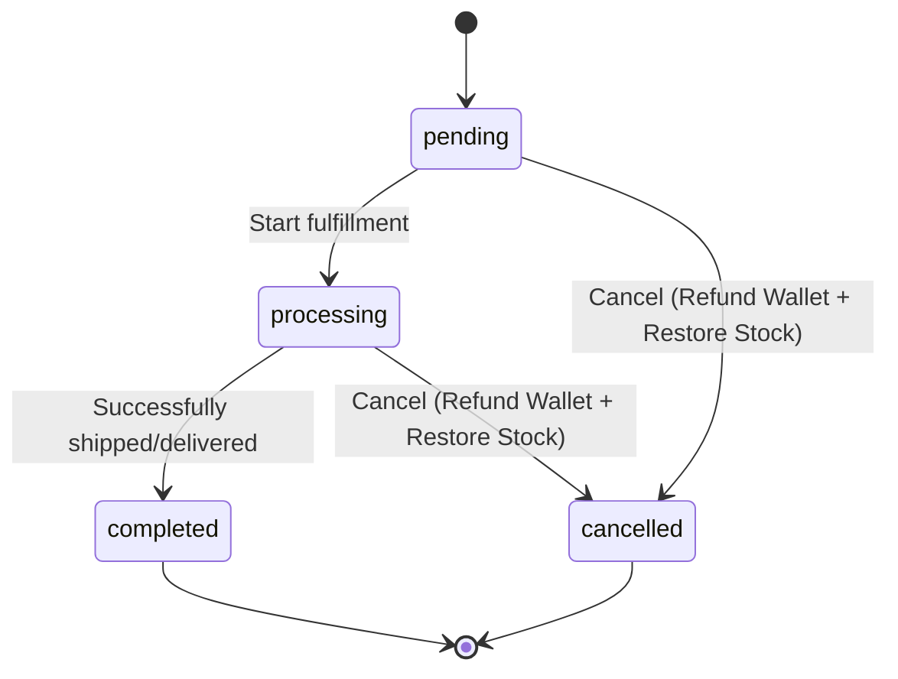
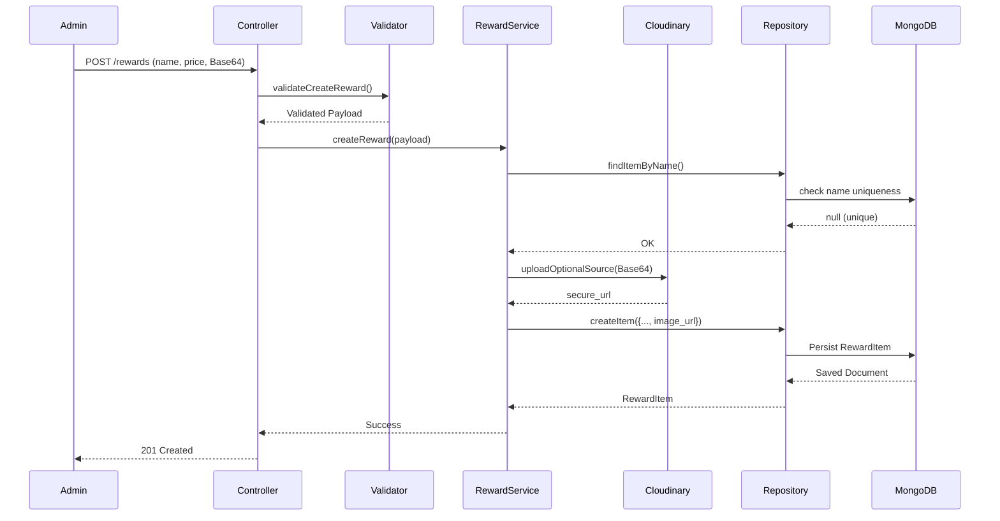
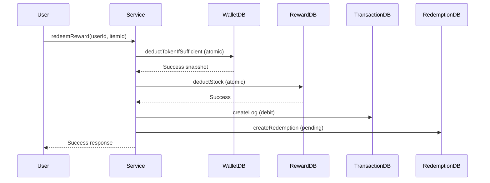
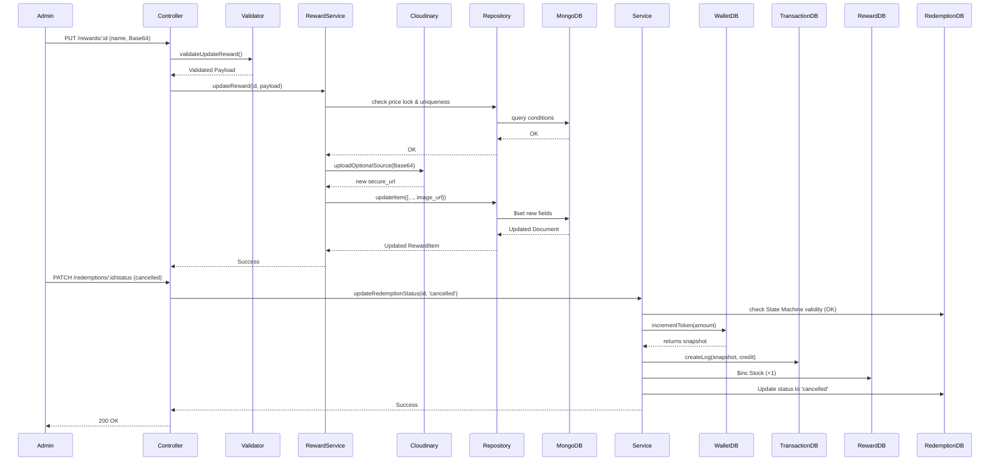

# Admin Reward Management Module

## 1. Business Overview

The Admin Reward Management module allows platform administrators to configure, manage, and oversee digital or physical items available for users to redeem using their token balances.

### Key Relationships

- **RewardItem**: Represents the available catalog items (e.g., vouchers, physical gifts). Maintains current stock, active status, token pricing, and optional images.
- **RedemptionHistory**: Tracks a user's claim of a RewardItem. It dictates the fulfillment lifecycle (`pending` -> `processing` -> `completed` / `cancelled`).
- **Wallet**: The user's token ledger. Redemptions deduct tokens from the Wallet, while cancellations refund tokens back.
- **TransactionHistory**: The immutable audit log. Deductions and refunds must emit exact before-and-after snapshots of the Wallet balance for financial traceability.

### Recent Architectural Changes

- **Optional Reward Images**: The module supports optional image uploads via Cloudinary.
- **Dynamic Pricing**: Arbitrary integer token prices (`>= 1`) are supported, removing historical constraints of predefined price packs. Existing `RedemptionHistory` records protect historical token prices from mutation once an item has been redeemed.

## 2. Business Flow

### Create Reward

1. Admin submits a JSON payload (`application/json`) containing `name`, `description`, `token_price`, `stock`, `is_active`, and optionally `image_file_data` (Base64) or `image_url`.
2. The system validates the payload, including verifying that the name is unique.
3. If image data is provided, it is uploaded to Cloudinary via `cloudinaryService.uploadOptionalSource()`.
4. The resulting `secure_url` from Cloudinary is stored as `image_url`.
5. The `RewardItem` is persisted to the database.

### Update Reward

- **Update without image**: The admin submits an update payload omitting image fields. The existing `image_url` is preserved safely.
- **Update with image**: The admin submits a new `image_file_data`. The new image is uploaded, and the `image_url` is updated.
- **Token Price Protection**: If the `token_price` is altered, the system checks that zero redemptions have occurred; otherwise, the edit is blocked to protect historical integrity.

### Other Flows

- **Get Statistics**: Aggregates high-level dashboard counts.
- **Update Stock**: Admin can manually adjust inventory levels (`increase`, `decrease`, or `set`) to restock popular items or handle discrepancies.
- **Enable / Disable Reward**: Admin toggles `is_active`. An item cannot be disabled if there are outstanding `pending` or `processing` claims.
- **List Rewards & Details**: Retrieves paginated catalogs and single-item snapshots.
- **Process Redemptions**: Transitions the lifecycle of a claim. Driven strictly by an allowed state machine transition matrix.
- **Refund & Restock Flow**: Executed exclusively when a status transitions to `cancelled`. It immediately queries the Wallet to restore the `token_spent` and increments the `RewardItem` stock, emitting a corresponding `TransactionHistory` audit log.

## 3. State Machine



### Explanations

- **pending**: User successfully claimed the item, but admin hasn't started shipping.
- **processing**: Admin acknowledged the claim and is processing the shipment.
- **completed**: The item reached the user. Terminal state.
- **cancelled**: Claim was aborted. Terminal state.

Rejecting out-of-bounds transitions maintains an irreversible, forward-only business logic. Refunding a `completed` claim is prohibited, as it implies real-world delivery has already occurred.

## 4. API Documentation

### 1. Create Reward

- **Method**: POST
- **Endpoint**: `/api/admin/rewards`
- **Authentication**: Required (Admin Only)
- **Content-Type**: `application/json` (NOT `multipart/form-data`)
- **Request Body**:
  - `name` (String)
  - `description` (String)
  - `token_price` (Integer >= 1)
  - `stock` (Integer >= 0)
  - `is_active` (Boolean, optional)
  - `image_file_data` (Base64 String starting with `data:image/`, optional)
  - `image_url` (HTTP/HTTPS String, optional)
- **Response**: `{ item: RewardItem }`
- **Status Codes**: 201 Created, 400 Bad Request, 409 Conflict

### 2. Update Reward

- **Method**: PUT
- **Endpoint**: `/api/admin/rewards/:id`
- **Authentication**: Required (Admin Only)
- **Content-Type**: `application/json`
- **Request Body**: `name`, `description`, `token_price`, `image_file_data`, `image_url`
- **Response**: `{ item: RewardItem }`
- **Business Logic**: Rejects modifications to `token_price` if redemptions exist. Omitting image fields preserves the current image.
- **Status Codes**: 200 OK, 400 Bad Request, 404 Not Found, 409 Conflict
### 3. Update Stock

- **Method**: PATCH
- **Endpoint**: `/api/admin/rewards/:id/stock`
- **Authentication**: Required
- **Authorization**: Admin Only
- **Purpose**: Directly mutate inventory counts.
- **Request Parameters**: `id` (ObjectId)
- **Request Body**: `{ operation: "increase"|"decrease"|"set", value: Number }`
- **Response**: `{ item: RewardItem }`
- **Business Logic**: Modifies the stock value atomically. Ensures stock does not fall below zero.
- **Database Collections Affected**: Updates `RewardItem`
- **Possible Errors**: 404 Not Found, 400 Bad Request (Stock below zero)
- **Status Codes**: 200 OK

### 4. Update Status (Enable/Disable)

- **Method**: PATCH
- **Endpoint**: `/api/admin/rewards/:id/status`
- **Authentication**: Required
- **Authorization**: Admin Only
- **Purpose**: Toggle availability.
- **Request Parameters**: `id` (ObjectId)
- **Request Body**: `{ is_active: Boolean }`
- **Response**: `{ item: RewardItem }`
- **Business Logic**: Cannot set `is_active: false` if there are pending/processing redemptions.
- **Database Collections Affected**: Reads `RedemptionHistory`, Updates `RewardItem`
- **Possible Errors**: 404 Not Found, 400 Bad Request
- **Status Codes**: 200 OK

### 5. List Redemptions

- **Method**: GET
- **Endpoint**: `/api/admin/rewards/redemptions`
- **Authentication**: Required
- **Authorization**: Admin Only
- **Purpose**: View paginated claims.
- **Query Parameters**: `user`, `reward`, `status`, `from`, `to`, `page`, `limit`
- **Response**: `{ redemptions, meta }`
- **Business Logic**: Retrieves paginated redemptions with filtering applied.
- **Database Collections Affected**: Reads `RedemptionHistory`
- **Possible Errors**: None specific
- **Status Codes**: 200 OK

### 6. Update Redemption Status

- **Method**: PATCH
- **Endpoint**: `/api/admin/rewards/redemptions/:id/status`
- **Authentication**: Required
- **Authorization**: Admin Only
- **Purpose**: Move a claim through the state machine.
- **Request Parameters**: `id` (ObjectId)
- **Request Body**: `{ status: "processing"|"completed"|"cancelled" }`
- **Response**: `{ redemption: RedemptionHistory }`
- **Business Logic**: Validates state transition. If `cancelled`, invokes refund logic (restore wallet, restore stock).
- **Database Collections Affected**: Reads `RedemptionHistory`, Updates `Wallet`, Updates `TransactionHistory`, Updates `RewardItem`, Updates `RedemptionHistory`
- **Side Effects**: Wallet increments, Audit log creation.
- **Possible Errors**: 404 Not Found, 400 Bad Request (Invalid transition)
- **Status Codes**: 200 OK

### 7. Other Endpoints (Summary)

- **GET `/api/admin/rewards/statistics`**: Returns high-level dashboard counts.
- **GET `/api/admin/rewards`**: Returns paginated inventory.
- **GET `/api/admin/rewards/:id`**: Returns a single `RewardItem`.

## 5. Validation Rules

- **Reward Name**: Must be between 3 and 100 characters.
- **Token Price**: Must strictly be an integer `>= 1`. Decimal, zero, and negative values are rejected.
- **Stock**: Must strictly be an integer `>= 0`.
- **image_file_data**: If provided, must be a valid string starting with `data:image/`.
- **image_url**: If provided, must be a valid HTTP or HTTPS URL.
- **Optional Images**: Images are fully optional. An item can be created without an image. When updating, omitting image fields leaves the existing image intact.
- **State Machine**: Enforced via a centralized `ALLOWED_TRANSITIONS` mapping.

## 6. RewardItem Schema

- **name**: (String) Unique name of the reward.
- **description**: (String) Detailed item description.
- **token_price**: (Number) Integer cost in tokens.
- **stock**: (Number) Current inventory count.
- **is_active**: (Boolean) Visibility toggle.
- **image_url**: (String) Secure URL resolving to the Cloudinary image asset.
- **created_by**: (ObjectId, Ref: User) Captures the admin who instantiated the item.
- **updated_by**: (ObjectId, Ref: User) Captures the admin who last modified the item.
- **created_at**: (Date) Timestamp of creation. Automatically managed by Mongoose.
- **updated_at**: (Date) Timestamp of last update. Automatically managed by Mongoose.

## 7. Cloudinary Integration

The module utilizes Cloudinary to handle all image storage.

- **Upload Flow**: Images are uploaded using `cloudinaryService.uploadOptionalSource()`.
- **Base64 JSON Upload**: The module accepts Base64 strings (`image_file_data`) inside standard `application/json` payloads.
- **Why Multer is NOT Used**: By using Base64 payloads over JSON, the API avoids the complexity of `multipart/form-data`, matching the standard integration patterns across the rest of the project (e.g., Avatars, Horses). This keeps request parsing unified and simple.
- **Image URL Persistence**: The response from Cloudinary (`secure_url`) is persisted directly into the database as `image_url`.
- **Orphan Asset Limitation**: The database schema does not store the Cloudinary `public_id`. Due to the fragility of reverse-engineering a `public_id` from a URL string, the system intentionally skips automatic asset deletion when a reward image is replaced. This produces "orphan" assets on Cloudinary, a conscious trade-off to prioritize system stability over perfect storage hygiene.

## 8. Express Configuration

To support Base64 image uploads, the Express application body parsers were updated:

```javascript
app.use(express.json({ limit: "5mb" }));
app.use(express.urlencoded({ extended: false, limit: "5mb" }));
```

**Reasoning**: The default Express JSON payload limit is `100kb`. Because Base64 representations of images can easily exceed this, the limit was raised to `5mb` to prevent HTTP 413 (Payload Too Large) errors during reward creation and updates.

## 9. Repository Layer

The `rewardRepository.js` has been updated to consistently return `image_url`. Queries executing `.populate('item_id')` across user redemptions and admin dashboards now project the `image_url` field natively, ensuring frontend clients receive immediate rendering capabilities.

## 10. Concurrency Design

- **Atomic Updates**: Critical manipulations (stock deductions, wallet deductions) rely on MongoDB `$inc` operators.
- **Stock Guard**: Stock deduction conditionally filters using `{ stock: { $gt: 0 } }`. If multiple parallel requests target the last unit of stock, the first write succeeds and decrements the value to 0. Subsequent writes fail the `$gt: 0` condition, safely rejecting the redemption without requiring multi-document transactions.
- **Wallet Guard**: Wallet deductions employ `{ token_balance: { $gte: price } }` to ensure users cannot drop into a negative balance.

## 11. Sequence Diagrams

### Create Reward (with Image)



### Update Reward

### Redeem Reward (Client-side trigger)



### Cancel Redemption (Refund Flow)



## 12. Controller / Service / Repository Mapping

| Route                           | Controller Function      | Service Function         | Repository Function                                   | Database Collection                                               |
| ------------------------------- | ------------------------ | ------------------------ | ----------------------------------------------------- | ----------------------------------------------------------------- |
| `GET /rewards/stats`            | `getStatistics`          | `getStatistics`          | `countAllItemsAdmin`, `countRedemptionsForAdmin`      | `RewardItem`, `RedemptionHistory`                                 |
| `GET /rewards`                  | `listRewards`            | `listAllRewards`         | `findAllItemsAdmin`, `countAllItemsAdmin`             | `RewardItem`                                                      |
| `GET /rewards/:id`              | `getReward`              | `getRewardDetail`        | `findItemById`                                        | `RewardItem`                                                      |
| `POST /rewards`                 | `createReward`           | `createReward`           | `createItem`, `findItemByName`                        | `RewardItem`                                                      |
| `PUT /rewards/:id`              | `updateReward`           | `updateReward`           | `updateItem`, `countRedemptionsByItemId`              | `RewardItem`, `RedemptionHistory`                                 |
| `PATCH /rewards/:id/stock`      | `updateRewardStock`      | `updateRewardStock`      | `updateStockAdmin`                                    | `RewardItem`                                                      |
| `PATCH /rewards/:id/status`     | `updateRewardStatus`     | `updateRewardStatus`     | `updateItem`, `countRedemptionsByItemIdAndStatus`     | `RewardItem`, `RedemptionHistory`                                 |
| `GET /redemptions`              | `listRedemptions`        | `listAdminRedemptions`   | `findRedemptionsForAdmin`, `countRedemptionsForAdmin` | `RedemptionHistory`                                               |
| `PATCH /redemptions/:id/status` | `updateRedemptionStatus` | `updateRedemptionStatus` | `updateRedemptionStatus`, `incrementToken`            | `RedemptionHistory`, `Wallet`, `TransactionHistory`, `RewardItem` |

## 13. Test Coverage

Automated testing resides in `tests/adminReward.test.js`. The suite covers:

- **Create Reward**: Successfully creating a reward without an image.
- **Create Reward with Image**: Successfully parsing Base64 `image_file_data` and URL-only implementations.
- **Update Reward**: Updating text details safely.
- **Update Reward with Image**: Verifying the image url accurately reflects new uploads.
- **Duplicate Name Validation**: Asserts 409 Conflict logic.
- **Token Price Validation**: Asserts rejection of decimal, negative, and zero pricing.
- **Invalid Image Data**: Asserts 400 Bad Request on malformed Base64 strings and invalid URLs.
- **Token Price Lock**: Asserts mutating `token_price` triggers a 400 Bad Request if redemptions exist.
- **State Machine Verification**: Forces invalid transitions (e.g., `cancelled` -> `completed`) and asserts 400 rejection.
- **Refund Integrity**: Validates that cancelling a redemption accurately restores wallet balances and increments stock.
- **Concurrency Verification**: Exploits `Promise.allSettled` to fire concurrent redemptions targeting a single unit of stock, asserting proper rejection of race conditions.

## 14. Business Rules

1. **Optional Images**: Reward images are optional.
2. **Image Preservation**: An existing image remains securely in place when an update payload omits image details.
3. **Cloudinary Storage**: All image blobs are outsourced to Cloudinary via standard JSON data streams.
4. **Token Price Immutability**: If an item has been redeemed at least once, its `token_price` is permanently locked to preserve historical fairness.
5. **Cancellation Restitution**: Cancelling a redemption implicitly restores the tokens back to the user's wallet and increments the item's available stock.
6. **Availability Guard**: A reward cannot be deactivated (`is_active: false`) if there are lingering `pending` or `processing` claims.
7. **Terminal States**: `completed` and `cancelled` states are strictly terminal.

## 15. Final Business Summary

This implementation provides a reliable and robust management framework. The design incorporates standard data handling practices suitable for scalable web operations.

The rollback strategy utilizes rapid compensating transactions — immediately issuing token refunds logged clearly in the `TransactionHistory` audit tables rather than relying on distributed locking mechanisms. Concurrency handling is implemented through atomic database directives, deflecting race conditions without external mutex overhead. The state machine validation strictly prevents out-of-order execution, preserving the integrity of operational metrics. Backwards compatibility remains preserved across all standard module layers.
