# PHASE 3 — PostgreSQL Schema Design

**Project:** `D:\Ki8\swp391\HorseRacingSystem`
**Source:** MongoDB 32 collections, ~564 documents
**Target:** PostgreSQL 18.4 local, database `horse_racing`
**ORM:** Sequelize (CommonJS)
**Primary Key Strategy:** UUID v4 generated by `gen_random_uuid()` (pgcrypto); legacy Mongo `ObjectId` mapped deterministically to UUID v5 in Phase 6 (data load).
**Foreign Key Strategy:** `ON DELETE RESTRICT ON UPDATE CASCADE` + soft delete (`deleted_at`) at application layer.
**Transaction Isolation:** `SERIALIZABLE` for every multi-document transaction (per Phase 2 review).

---

## Mục lục

1. [Giới thiệu](#1-giới-thiệu)
2. [Quyết định kiến trúc](#2-quyết-định-kiến-trúc-đã-chốt)
3. [Naming Conventions](#3-naming-conventions)
4. [Common Column Types Mapping](#4-common-column-types-mapping-mongo--postgres)
5. [Danh sách Tables](#5-danh-sách-tables)
   - 5.1 [Identity & Roles](#51-identity--roles)
   - 5.2 [Profiles](#52-profiles)
   - 5.3 [Horses & Ratings](#53-horses--ratings)
   - 5.4 [Tournaments & Rounds](#54-tournaments--rounds)
   - 5.5 [Races](#55-races)
   - 5.6 [Registrations](#56-registrations)
   - 5.7 [Jockey Assignments](#57-jockey-assignments)
   - 5.8 [Horse Checks & Violations](#58-horse-checks--violations)
   - 5.9 [Race Results & Prizes](#59-race-results--prizes)
   - 5.10 [Betting & Odds](#510-betting--odds)
   - 5.11 [Referee Reports](#511-referee-reports)
   - 5.12 [Wallets & Transactions](#512-wallets--transactions)
   - 5.13 [Deposits](#513-deposits)
   - 5.14 [Rewards & Redemptions](#514-rewards--redemptions)
   - 5.15 [Notifications & Role Applications](#515-notifications--role-applications)
6. [Indexes](#6-indexes)
7. [Triggers](#7-triggers)
8. [CHECK Constraints](#8-check-constraints)
9. [ER Diagram (Mermaid)](#9-er-diagram-mermaid)
10. [Migration Order](#10-migration-order)
11. [Open Questions](#11-open-questions)

---

## 1. Giới thiệu

Tài liệu này mô tả thiết kế schema PostgreSQL cuối cùng cho hệ thống Horse Racing, được derive từ 32 Mongoose collections hiện hữu. Mục tiêu:

- **Đúng đắn:** bảo toàn semantics Mongo (unique, sparse unique, partial unique, validation ranges).
- **Hiệu năng:** indexes chuyển đổi 1-1; partial unique → `CREATE UNIQUE INDEX … WHERE …`.
- **Toàn vẹn:** FK với `ON DELETE RESTRICT`, CHECK constraints cho business rules, triggers cho invariants phức tạp.
- **Migrate-friendly:** mọi table có `id UUID PK`, `created_at`, `updated_at`, `deleted_at` (trừ audit tables).

Phase 3 chỉ dừng lại ở **schema design + DDL**, KHÔNG chạy apply ở phase này.

---

## 2. Quyết định kiến trúc đã chốt

| # | Quyết định | Lý do |
|---|---|---|
| 1 | FK strategy: `ON DELETE RESTRICT` + soft delete (`deleted_at`) ở app layer | Tránh mất dữ liệu lịch sử; restore dễ |
| 2 | Tx isolation: `SERIALIZABLE` | An toàn cho multi-doc transaction (Phase 2 review) |
| 3 | `$expr` slot check: **Postgres trigger** BEFORE INSERT/UPDATE trên `races.registration_slot_count` | Tương đương `$expr` Mongo, chạy DB-side |
| 4 | Embedded sub-doc strategy: **Normalize all** | Truy vấn + reporting dễ hơn; JSONB chỉ cho snapshot không truy vấn |
| 5 | Partial unique indexes: reproduce tất cả bằng `CREATE UNIQUE INDEX … WHERE …` | 1-1 với Mongo semantics |
| 6 | Sparse unique (`payment_order_id`, `gateway_reference_id`, `reference_id`): PG partial unique với `WHERE col IS NOT NULL` | NULL được phép nhiều row |
| 7 | `deposit_requests.package_id` là **string FK** tới `deposit_packages.package_id` | Giữ ổn định khi đổi tên package |
| 8 | JSONB cho snapshot context; child table cho arrays of entities | Phù hợp pattern truy vấn |

---

## 3. Naming Conventions

- **Table names:** `snake_case`, số nhiều (`users`, `horse_owners`, `race_odds_markets`).
- **Column names:** `snake_case` (`created_at`, `user_id`, `token_balance`).
- **PK column:** luôn là `id` (UUID).
- **FK columns:** `<singular_referenced_table>_id` (vd `user_id`, `horse_id`, `race_id`, `tournament_id`).
- **String FK:** dùng tên gốc — vd `package_id` (string) trong `deposit_requests`.
- **Timestamps:** `created_at`, `updated_at` (TIMESTAMPTZ).
- **Soft delete:** `deleted_at TIMESTAMPTZ NULL` (audit tables như `transaction_histories` không có).
- **Booleans:** prefix `is_` / `has_` / `requires_` (`is_active`, `is_read`, `email_verified`, `requires_violation`).
- **JSONB:** hậu tố `_snapshot`, `_data`, `_context`, `_metrics`, `_info`, `_diagnostics`.
- **Child tables:** `<parent_table>_<noun>` (vd `race_odds_market_odds`, `role_application_documents`).

---

## 4. Common Column Types Mapping (Mongo → Postgres)

| Mongo Type | Postgres Type | Ghi chú |
|---|---|---|
| `String` (no maxlength) | `TEXT` | trừ khi đặc biệt cần index `VARCHAR(N)` (vd `package_id VARCHAR(64)`, `registration_number VARCHAR(128)`) |
| `String` (enum) | `TEXT` + `CHECK (col IN (...))` | Postgres không dùng native `ENUM` (cho phép ADD VALUE dễ hơn) |
| `Number` (integer) | `INTEGER` / `BIGINT` | default `INTEGER`; rating, position, etc. dùng `INTEGER`; race counters dùng `INTEGER` |
| `Number` (decimal currency) | `NUMERIC(15,2)` | VND, prize amounts |
| `Number` (probability 0–1) | `NUMERIC(6,5)` (6 digits, 5 after decimal) | đủ cho `0.12345`; vẫn check `BETWEEN 0 AND 1` |
| `Number` (odds >= 1) | `NUMERIC(6,2)` | đủ cho `999.99`; check `>= 1` |
| `Number` (weight kg) | `NUMERIC(6,2)` | check `BETWEEN 30 AND 100` (jockeys) |
| `Number` (small enum int) | `INTEGER` | race_no, position, percent |
| `Boolean` | `BOOLEAN` | — |
| `Date` | `TIMESTAMPTZ` | luôn TZ-aware |
| `ObjectId` | `UUID` | map v5 deterministic Phase 6 |
| `Mixed` / `Schema.Types.Mixed` | `JSONB` | default `'{}'::jsonb` |
| `Array<String>` (small enum, indexed) | `TEXT[]` (vd `gears`, `default_gears`) | — |
| `Array<ObjectId>` (refs) | child table (vd `race_result_applied_violations`) | normalize |
| `Array<embedded>` (sub-doc) | child table (vd `race_odds_market_odds`) | normalize |
| Enum (Mongoose `enum:[…]`) | `TEXT` + `CHECK` | KHÔNG dùng `CREATE TYPE … AS ENUM` ở phase này để dễ ADD VALUE |
| Sparse unique | `WHERE col IS NOT NULL` partial index | — |
| Partial unique (compound condition) | `WHERE …` partial index | — |

---

## 5. Danh sách Tables

### 5.1 Identity & Roles

#### 5.1.1 `users`
Chuyển từ `users` collection. Bỏ tất cả field `select: false` ở DB level — app layer tự filter.

| Column | Type | Constraints | Notes |
|---|---|---|---|
| `id` | UUID | PK, DEFAULT `gen_random_uuid()` | — |
| `full_name` | TEXT | NOT NULL | — |
| `email` | TEXT | NOT NULL, UNIQUE, lowercased | `LOWER(email)` index trùng UNIQUE |
| `password` | TEXT | NOT NULL | bcrypt hash |
| `phone_number` | TEXT | NULL | — |
| `date_of_birth` | TIMESTAMPTZ | NULL | |
| `avatar_url` | TEXT | NULL | |
| `avatar_public_id` | TEXT | NULL | |
| `status` | TEXT | NOT NULL DEFAULT `'active'`, CHECK IN (`active`,`inactive`,`suspended`,`banned`,`deleted`) | — |
| `email_verified` | BOOLEAN | NOT NULL DEFAULT FALSE | |
| `email_verified_at` | TIMESTAMPTZ | NULL | |
| `email_verification_token` | TEXT | NULL | app-side |
| `email_verification_expires_at` | TIMESTAMPTZ | NULL | |
| `password_reset_token` | TEXT | NULL | app-side |
| `password_reset_expires_at` | TIMESTAMPTZ | NULL | |
| `password_changed_at` | TIMESTAMPTZ | NULL | |
| `created_at` | TIMESTAMPTZ | NOT NULL DEFAULT `now()` | |
| `updated_at` | TIMESTAMPTZ | NOT NULL DEFAULT `now()` | trigger `users_updated_at_touch` |
| `deleted_at` | TIMESTAMPTZ | NULL | soft delete |

Indexes:
- `users_email_lower_uniq` UNIQUE on `(LOWER(email))` WHERE `deleted_at IS NULL`
- `users_phone_idx` on `(phone_number)` WHERE `phone_number IS NOT NULL`

#### 5.1.2 `roles`
Chuyển từ `roles` collection. Lookup table, không có timestamp tự động nhưng vẫn giữ `created_at`/`updated_at`.

| Column | Type | Constraints |
|---|---|---|
| `id` | UUID | PK |
| `role_name` | TEXT | NOT NULL, UNIQUE, CHECK IN (`admin`,`horse_owner`,`jockey`,`race_referee`,`spectator`) |
| `description` | TEXT | NULL |
| `created_at` | TIMESTAMPTZ | NOT NULL DEFAULT `now()` |
| `updated_at` | TIMESTAMPTZ | NOT NULL DEFAULT `now()` |
| `deleted_at` | TIMESTAMPTZ | NULL |

#### 5.1.3 `user_roles`
Join table giữa `users` ↔ `roles` (M-to-M).

| Column | Type | Constraints |
|---|---|---|
| `id` | UUID | PK |
| `user_id` | UUID | NOT NULL, FK → `users(id)` ON DELETE RESTRICT |
| `role_id` | UUID | NOT NULL, FK → `roles(id)` ON DELETE RESTRICT |
| `created_at` | TIMESTAMPTZ | NOT NULL DEFAULT `now()` |
| `deleted_at` | TIMESTAMPTZ | NULL |

Indexes:
- `user_roles_user_id_idx` on `(user_id)`
- `user_roles_role_id_idx` on `(role_id)`
- `user_roles_pair_uniq` UNIQUE on `(user_id, role_id)` WHERE `deleted_at IS NULL`

---

### 5.2 Profiles

#### 5.2.1 `horse_owners`

| Column | Type | Constraints |
|---|---|---|
| `id` | UUID | PK |
| `user_id` | UUID | NOT NULL, UNIQUE, FK → `users(id)` ON DELETE RESTRICT |
| `stable_name` | TEXT | NULL |
| `address` | TEXT | NULL |
| `license_number` | TEXT | NULL |
| `status` | TEXT | NOT NULL DEFAULT `'active'`, CHECK IN (`active`,`inactive`,`suspended`) |
| `created_at` | TIMESTAMPTZ | NOT NULL DEFAULT `now()` |
| `updated_at` | TIMESTAMPTZ | NOT NULL DEFAULT `now()` |
| `deleted_at` | TIMESTAMPTZ | NULL |

Indexes:
- `horse_owners_license_uniq` UNIQUE on `(license_number)` WHERE `license_number IS NOT NULL AND deleted_at IS NULL`

#### 5.2.2 `jockeys`

| Column | Type | Constraints |
|---|---|---|
| `id` | UUID | PK |
| `user_id` | UUID | NOT NULL, UNIQUE, FK → `users(id)` ON DELETE RESTRICT |
| `height` | INTEGER | NULL |
| `weight` | INTEGER | NULL (legacy; raw kg) |
| `weight_kg` | NUMERIC(5,2) | NULL, CHECK BETWEEN 30 AND 100 |
| `experience_years` | INTEGER | NOT NULL DEFAULT 0, CHECK >= 0 |
| `license_number` | TEXT | NULL |
| `total_races` | INTEGER | NOT NULL DEFAULT 0, CHECK >= 0 |
| `total_wins` | INTEGER | NOT NULL DEFAULT 0, CHECK >= 0 |
| `suspended_until` | TIMESTAMPTZ | NULL |
| `outstanding_fine_amount` | NUMERIC(15,2) | NOT NULL DEFAULT 0, CHECK >= 0 |
| `disciplinary_status` | TEXT | NOT NULL DEFAULT `'clear'`, CHECK IN (`clear`,`suspended`) |
| `status` | TEXT | NOT NULL DEFAULT `'active'` |
| `created_at` | TIMESTAMPTZ | NOT NULL DEFAULT `now()` |
| `updated_at` | TIMESTAMPTZ | NOT NULL DEFAULT `now()` |
| `deleted_at` | TIMESTAMPTZ | NULL |

Indexes:
- `jockeys_license_uniq` UNIQUE on `(license_number)` WHERE `license_number IS NOT NULL AND deleted_at IS NULL`
- `jockeys_status_idx` on `(status)`

#### 5.2.3 `race_referees`

| Column | Type | Constraints |
|---|---|---|
| `id` | UUID | PK |
| `user_id` | UUID | NOT NULL, UNIQUE, FK → `users(id)` ON DELETE RESTRICT |
| `license_number` | TEXT | NULL |
| `experience_years` | INTEGER | NOT NULL DEFAULT 0 |
| `status` | TEXT | NOT NULL DEFAULT `'active'` |
| `created_at` | TIMESTAMPTZ | NOT NULL DEFAULT `now()` |
| `updated_at` | TIMESTAMPTZ | NOT NULL DEFAULT `now()` |
| `deleted_at` | TIMESTAMPTZ | NULL |

Indexes:
- `race_referees_license_uniq` UNIQUE on `(license_number)` WHERE `license_number IS NOT NULL AND deleted_at IS NULL`

---

### 5.3 Horses & Ratings

#### 5.3.1 `horses`

| Column | Type | Constraints |
|---|---|---|
| `id` | UUID | PK |
| `owner_id` | UUID | NOT NULL, FK → `horse_owners(id)` ON DELETE RESTRICT |
| `name` | TEXT | NOT NULL |
| `breed` | TEXT | NULL |
| `gender` | TEXT | NULL |
| `date_of_birth` | TIMESTAMPTZ | NULL |
| `color` | TEXT | NULL |
| `weight` | INTEGER | NULL (legacy raw weight) |
| `current_rating` | INTEGER | NOT NULL DEFAULT 50, CHECK BETWEEN 0 AND 140 |
| `rating_updated_at` | TIMESTAMPTZ | NULL |
| `rating_updated_by` | UUID | NULL, FK → `users(id)` ON DELETE RESTRICT |
| `default_gears` | TEXT[] | NOT NULL DEFAULT `ARRAY[]::TEXT[]`, CHECK each in `HORSE_GEAR_CODES` (vd `B`,`BO`,`V`,`TT`,`CP`,`CO`,`H`,`P`,`PC`,`PS`,`SR`,`SB`,`E`,`XB`,`CC`) — enforce bằng trigger |
| `health_status` | TEXT | NULL |
| `registration_number` | TEXT | NOT NULL, UNIQUE (per `registration_number` index Mongo) |
| `image_url` | TEXT | NULL |
| `image_public_id` | TEXT | NULL |
| `status` | TEXT | NOT NULL DEFAULT `'active'`, CHECK IN (`active`,`inactive`,`retired`) |
| `created_at` | TIMESTAMPTZ | NOT NULL DEFAULT `now()` |
| `updated_at` | TIMESTAMPTZ | NOT NULL DEFAULT `now()` |
| `deleted_at` | TIMESTAMPTZ | NULL |

Indexes:
- `horses_owner_idx` on `(owner_id)` WHERE `deleted_at IS NULL`
- `horses_status_idx` on `(status)` WHERE `deleted_at IS NULL`

Trigger: `horses_default_gears_check` BEFORE INSERT/UPDATE — verify mọi element ∈ `HORSE_GEAR_CODES`.

#### 5.3.2 `horse_rating_history`
Audit/append-only-ish table.

| Column | Type | Constraints |
|---|---|---|
| `id` | UUID | PK |
| `horse_id` | UUID | NOT NULL, FK → `horses(id)` ON DELETE RESTRICT |
| `race_id` | UUID | NULL, FK → `races(id)` ON DELETE RESTRICT |
| `previous_rating` | INTEGER | NOT NULL, CHECK BETWEEN 0 AND 140 |
| `rating_delta` | INTEGER | NOT NULL |
| `new_rating` | INTEGER | NOT NULL, CHECK BETWEEN 0 AND 140 |
| `expected_score` | NUMERIC(6,5) | NULL |
| `actual_score` | NUMERIC(6,5) | NULL |
| `raw_position` | INTEGER | NULL |
| `participant_count` | INTEGER | NULL |
| `calculation_version` | TEXT | NOT NULL DEFAULT `'pairwise_elo_v1'` |
| `source` | TEXT | NOT NULL, CHECK IN (`published_result`,`manual_admin`,`migration`) |
| `reason` | TEXT | NULL |
| `calculated_by` | UUID | NULL, FK → `users(id)` ON DELETE RESTRICT |
| `calculated_at` | TIMESTAMPTZ | NOT NULL DEFAULT `now()` |
| `created_at` | TIMESTAMPTZ | NOT NULL DEFAULT `now()` |
| `deleted_at` | TIMESTAMPTZ | NULL |

Indexes:
- `horse_rating_history_horse_idx` on `(horse_id)`
- `horse_rating_history_source_idx` on `(source)`
- `horse_rating_history_race_horse_pubresult_uniq` UNIQUE on `(race_id, horse_id)` WHERE `race_id IS NOT NULL AND source = 'published_result' AND deleted_at IS NULL`

---

### 5.4 Tournaments & Rounds

#### 5.4.1 `tournaments`

| Column | Type | Constraints |
|---|---|---|
| `id` | UUID | PK |
| `name` | TEXT | NOT NULL |
| `description` | TEXT | NULL |
| `location` | TEXT | NULL |
| `image_url` | TEXT | NULL |
| `image_public_id` | TEXT | NULL |
| `start_date` | TIMESTAMPTZ | NULL |
| `end_date` | TIMESTAMPTZ | NULL, CHECK (`end_date IS NULL OR start_date IS NULL OR end_date >= start_date`) |
| `status` | TEXT | NOT NULL DEFAULT `'draft'`, CHECK IN (`draft`,`active`,`completed`,`cancelled`,`archived`) |
| `created_by` | UUID | NOT NULL, FK → `users(id)` ON DELETE RESTRICT |
| `created_at` | TIMESTAMPTZ | NOT NULL DEFAULT `now()` |
| `updated_at` | TIMESTAMPTZ | NOT NULL DEFAULT `now()` |
| `deleted_at` | TIMESTAMPTZ | NULL |

Indexes:
- `tournaments_created_by_idx` on `(created_by)`
- `tournaments_status_idx` on `(status)` WHERE `deleted_at IS NULL`

#### 5.4.2 `rounds`

| Column | Type | Constraints |
|---|---|---|
| `id` | UUID | PK |
| `tournament_id` | UUID | NOT NULL, FK → `tournaments(id)` ON DELETE RESTRICT |
| `name` | TEXT | NOT NULL |
| `round_order` | INTEGER | NOT NULL, CHECK > 0 |
| `description` | TEXT | NULL |
| `status` | TEXT | NOT NULL DEFAULT `'draft'` |
| `created_at` | TIMESTAMPTZ | NOT NULL DEFAULT `now()` |
| `updated_at` | TIMESTAMPTZ | NOT NULL DEFAULT `now()` |
| `deleted_at` | TIMESTAMPTZ | NULL |

Indexes:
- `rounds_tournament_order_uniq` UNIQUE on `(tournament_id, round_order)` WHERE `deleted_at IS NULL`
- `rounds_tournament_idx` on `(tournament_id)` WHERE `deleted_at IS NULL`

---

### 5.5 Races

#### 5.5.1 `races`

| Column | Type | Constraints |
|---|---|---|
| `id` | UUID | PK |
| `tournament_id` | UUID | NOT NULL, FK → `tournaments(id)` ON DELETE RESTRICT |
| `round_id` | UUID | NOT NULL, FK → `rounds(id)` ON DELETE RESTRICT |
| `name` | TEXT | NOT NULL |
| `image_url` | TEXT | NULL |
| `image_public_id` | TEXT | NULL |
| `race_no` | INTEGER | NOT NULL DEFAULT 1, CHECK > 0 |
| `race_date` | TIMESTAMPTZ | NULL |
| `distance` | INTEGER | NULL, CHECK > 0 |
| `max_participants` | INTEGER | NULL, CHECK > 0 OR NULL |
| `location` | TEXT | NULL |
| `venue_code` | TEXT | NULL, uppercased by app |
| `course` | TEXT | NOT NULL DEFAULT `'B+2'`, CHECK IN (`A`,`A+3`,`B`,`B+2`,`C`,`C+3`) |
| `race_class` | TEXT | NOT NULL DEFAULT `'5'`, CHECK IN (`1`,`2`,`3`,`4`,`5`) |
| `going` | TEXT | NOT NULL DEFAULT `'Good'`, CHECK IN (`Fast`,`Good`,`Good To Firm`,`Good To Yielding`,`Wet Slow`,`Yielding`) |
| `surface` | TEXT | NOT NULL DEFAULT `'Turf'`, CHECK IN (`Turf`,`Dirt`,`Synthetic`) |
| `referee_id` | UUID | NULL, FK → `race_referees(id)` ON DELETE RESTRICT |
| `registration_lock_at` | TIMESTAMPTZ | NULL |
| `registration_locked` | BOOLEAN | NOT NULL DEFAULT FALSE |
| `registration_slot_count` | INTEGER | NOT NULL DEFAULT 0, CHECK >= 0 |
| `registration_slots_initialized` | BOOLEAN | NOT NULL DEFAULT FALSE |
| `entries_finalized_at` | TIMESTAMPTZ | NULL |
| `entries_finalized_by` | UUID | NULL, FK → `users(id)` ON DELETE RESTRICT |
| `model_input_version` | INTEGER | NOT NULL DEFAULT 0, CHECK >= 0 |
| `status` | TEXT | NOT NULL DEFAULT `'scheduled'`, CHECK IN (`scheduled`,`entries_finalized`,`running`,`completed`,`cancelled`,`postponed`) |
| `starting_at` | TIMESTAMPTZ | NULL |
| `started_at` | TIMESTAMPTZ | NULL |
| `assignment_revision` | INTEGER | NOT NULL DEFAULT 0, CHECK >= 0 |
| `betting_status` | TEXT | NOT NULL DEFAULT `'unavailable'`, CHECK IN (`unavailable`,`open`,`closed`,`settled`) |
| `betting_closes_at` | TIMESTAMPTZ | NULL |
| `betting_market` | JSONB | NOT NULL DEFAULT `'{}'::jsonb` |
| `entry_fee` | NUMERIC(15,2) | NOT NULL DEFAULT 0, CHECK >= 0 |
| `entry_fee_currency` | TEXT | NOT NULL DEFAULT `'VND'`, uppercased |
| `prize_pool` | NUMERIC(15,2) | NOT NULL DEFAULT 0, CHECK >= 0 |
| `prize_currency` | TEXT | NOT NULL DEFAULT `'VND'`, uppercased |
| `created_at` | TIMESTAMPTZ | NOT NULL DEFAULT `now()` |
| `updated_at` | TIMESTAMPTZ | NOT NULL DEFAULT `now()` |
| `deleted_at` | TIMESTAMPTZ | NULL |

Indexes:
- `races_tournament_idx` on `(tournament_id)` WHERE `deleted_at IS NULL`
- `races_round_idx` on `(round_id)` WHERE `deleted_at IS NULL`
- `races_registration_lock_idx` on `(registration_locked, registration_lock_at)`
- `races_referee_date_idx` on `(referee_id, race_date)`
- `races_referee_status_idx` on `(referee_id, status)`
- `races_betting_status_idx` on `(betting_status)` WHERE `deleted_at IS NULL`

Triggers:
- `races_registration_slot_check` BEFORE INSERT/UPDATE — `IF max_participants IS NOT NULL AND max_participants > 0 AND NEW.registration_slot_count > max_participants THEN RAISE EXCEPTION ...`
- `races_registration_lock_at_auto` BEFORE INSERT/UPDATE — set `registration_lock_at = race_date - interval '3 hours'` IF `registration_lock_at IS NULL` AND `race_date IS NOT NULL`.

#### 5.5.2 `race_prize_distribution_items`
Normalize `races.prize_distribution[]` thành child table.

| Column | Type | Constraints |
|---|---|---|
| `id` | UUID | PK |
| `race_id` | UUID | NOT NULL, FK → `races(id)` ON DELETE RESTRICT |
| `position` | INTEGER | NOT NULL, CHECK > 0 |
| `percent` | NUMERIC(5,2) | NULL, CHECK BETWEEN 0 AND 100 |
| `amount` | NUMERIC(15,2) | NULL, CHECK >= 0 |
| `label` | TEXT | NULL |
| `created_at` | TIMESTAMPTZ | NOT NULL DEFAULT `now()` |
| `updated_at` | TIMESTAMPTZ | NOT NULL DEFAULT `now()` |
| `deleted_at` | TIMESTAMPTZ | NULL |

Indexes:
- `race_prize_distribution_items_race_position_uniq` UNIQUE on `(race_id, position)` WHERE `deleted_at IS NULL`
- `race_prize_distribution_items_race_idx` on `(race_id)` WHERE `deleted_at IS NULL`

---

### 5.6 Registrations

#### 5.6.1 `registrations`

| Column | Type | Constraints |
|---|---|---|
| `id` | UUID | PK |
| `tournament_id` | UUID | NOT NULL, FK → `tournaments(id)` ON DELETE RESTRICT |
| `race_id` | UUID | NOT NULL, FK → `races(id)` ON DELETE RESTRICT |
| `horse_id` | UUID | NOT NULL, FK → `horses(id)` ON DELETE RESTRICT |
| `owner_id` | UUID | NOT NULL, FK → `horse_owners(id)` ON DELETE RESTRICT |
| `horse_no` | INTEGER | NULL, CHECK > 0 |
| `draw` | INTEGER | NULL, CHECK > 0 |
| `rating_snapshot` | INTEGER | NULL, CHECK BETWEEN 0 AND 140 |
| `gears` | TEXT[] | NOT NULL DEFAULT `ARRAY[]::TEXT[]` (gear codes) |
| `declared_weight_kg` | NUMERIC(6,2) | NOT NULL DEFAULT 54.5, CHECK BETWEEN 40 AND 75 |
| `entry_finalized_at` | TIMESTAMPTZ | NULL |
| `entry_finalized_by` | UUID | NULL, FK → `users(id)` ON DELETE RESTRICT |
| `status` | TEXT | NOT NULL DEFAULT `'pending'`, CHECK IN (`pending`,`approved`,`rejected`,`cancelled`) |
| `note` | TEXT | NULL |
| `admin_note` | TEXT | NULL |
| `entry_fee_vnd` | NUMERIC(15,2) | NOT NULL DEFAULT 0, CHECK >= 0 |
| `entry_fee_token` | INTEGER | NOT NULL DEFAULT 0, CHECK >= 0 |
| `payment_status` | TEXT | NOT NULL DEFAULT `'not_required'`, CHECK IN (`not_required`,`pending`,`paid`,`failed`,`refund_pending`,`refund_sent`,`refunded`) |
| `payment_method` | TEXT | NULL, CHECK IN (`VNPAY`,`MOMO`,`MOCK`) |
| `payment_order_id` | TEXT | NULL |
| `payment_expires_at` | TIMESTAMPTZ | NULL |
| `gateway_reference_id` | TEXT | NULL |
| `payment_transaction_id` | UUID | NULL, FK → `transaction_histories(id)` ON DELETE RESTRICT |
| `payment_paid_at` | TIMESTAMPTZ | NULL |
| `payment_refunded_at` | TIMESTAMPTZ | NULL |
| `slot_reserved` | BOOLEAN | NOT NULL DEFAULT FALSE |
| `slot_reserved_at` | TIMESTAMPTZ | NULL |
| `slot_released_at` | TIMESTAMPTZ | NULL |
| `registered_at` | TIMESTAMPTZ | NOT NULL DEFAULT `now()` |
| `approved_by` | UUID | NULL, FK → `users(id)` ON DELETE RESTRICT |
| `approved_at` | TIMESTAMPTZ | NULL |
| `created_at` | TIMESTAMPTZ | NOT NULL DEFAULT `now()` |
| `updated_at` | TIMESTAMPTZ | NOT NULL DEFAULT `now()` |
| `deleted_at` | TIMESTAMPTZ | NULL |

Indexes:
- `registrations_race_horse_uniq` UNIQUE on `(race_id, horse_id)` WHERE `deleted_at IS NULL`
- `registrations_race_status_idx` on `(race_id, status)`
- `registrations_race_horse_no_uniq` UNIQUE on `(race_id, horse_no)` WHERE `horse_no IS NOT NULL AND deleted_at IS NULL`
- `registrations_race_draw_uniq` UNIQUE on `(race_id, draw)` WHERE `draw IS NOT NULL AND deleted_at IS NULL`
- `registrations_payment_order_id_uniq` UNIQUE on `(payment_order_id)` WHERE `payment_order_id IS NOT NULL AND deleted_at IS NULL`
- `registrations_gateway_reference_id_uniq` UNIQUE on `(gateway_reference_id)` WHERE `gateway_reference_id IS NOT NULL AND deleted_at IS NULL`
- `registrations_payment_status_idx` on `(payment_status)`
- `registrations_slot_reserved_idx` on `(slot_reserved)` WHERE `slot_reserved = TRUE`
- `registrations_tournament_idx` on `(tournament_id)`
- `registrations_owner_idx` on `(owner_id)`
- `registrations_horse_idx` on `(horse_id)`
- `registrations_approved_by_idx` on `(approved_by)`
- `registrations_payment_transaction_idx` on `(payment_transaction_id)` WHERE `payment_transaction_id IS NOT NULL`

#### 5.6.2 `registration_cancellation_tickets`

| Column | Type | Constraints |
|---|---|---|
| `id` | UUID | PK |
| `registration_id` | UUID | NOT NULL, FK → `registrations(id)` ON DELETE RESTRICT |
| `tournament_id` | UUID | NOT NULL, FK → `tournaments(id)` ON DELETE RESTRICT |
| `race_id` | UUID | NOT NULL, FK → `races(id)` ON DELETE RESTRICT |
| `owner_id` | UUID | NOT NULL, FK → `horse_owners(id)` ON DELETE RESTRICT |
| `horse_id` | UUID | NOT NULL, FK → `horses(id)` ON DELETE RESTRICT |
| `reason` | TEXT | NOT NULL, maxlength 1000 |
| `status` | TEXT | NOT NULL DEFAULT `'pending'`, CHECK IN (`pending`,`approved`,`rejected`) |
| `refund_status` | TEXT | NOT NULL DEFAULT `'not_required'`, CHECK IN (`not_required`,`awaiting_approval`,`pending`,`awaiting_owner_confirmation`,`completed`,`failed`) |
| `refund_amount_vnd` | NUMERIC(15,2) | NOT NULL DEFAULT 0, CHECK >= 0 |
| `requested_at` | TIMESTAMPTZ | NOT NULL DEFAULT `now()` |
| `reviewed_by` | UUID | NULL, FK → `users(id)` ON DELETE RESTRICT |
| `reviewed_at` | TIMESTAMPTZ | NULL |
| `admin_note` | TEXT | NULL, maxlength 1000 |
| `refund_reference` | TEXT | NULL, maxlength 255 |
| `refund_sent_by` | UUID | NULL, FK → `users(id)` ON DELETE RESTRICT |
| `refund_sent_at` | TIMESTAMPTZ | NULL |
| `owner_confirmed_at` | TIMESTAMPTZ | NULL |
| `owner_confirmation_note` | TEXT | NULL, maxlength 1000 |
| `created_at` | TIMESTAMPTZ | NOT NULL DEFAULT `now()` |
| `updated_at` | TIMESTAMPTZ | NOT NULL DEFAULT `now()` |
| `deleted_at` | TIMESTAMPTZ | NULL |

Indexes:
- `registration_cancellation_tickets_reg_status_pending_uniq` UNIQUE on `(registration_id, status)` WHERE `status = 'pending' AND deleted_at IS NULL`
- `registration_cancellation_tickets_owner_created_idx` on `(owner_id, created_at DESC)`
- `registration_cancellation_tickets_status_created_idx` on `(status, created_at)`

---

### 5.7 Jockey Assignments

#### 5.7.1 `jockey_assignments`
Top-level record. Các embedded sub-docs (`meeting`, `terms`, `standby_terms`, `contract`, `standby_contract`, `promotion`, `cancellation_request`, `withdrawal`) được split thành các child table dưới đây.

| Column | Type | Constraints |
|---|---|---|
| `id` | UUID | PK |
| `race_id` | UUID | NOT NULL, FK → `races(id)` ON DELETE RESTRICT |
| `horse_id` | UUID | NOT NULL, FK → `horses(id)` ON DELETE RESTRICT |
| `owner_id` | UUID | NOT NULL, FK → `horse_owners(id)` ON DELETE RESTRICT |
| `jockey_id` | UUID | NOT NULL, FK → `jockeys(id)` ON DELETE RESTRICT |
| `assignment_type` | TEXT | NOT NULL DEFAULT `'primary'`, CHECK IN (`primary`,`backup`) |
| `backup_priority` | INTEGER | NULL, CHECK > 0 |
| `backup_for_assignment_id` | UUID | NULL, FK → `jockey_assignments(id)` ON DELETE RESTRICT |
| `status` | TEXT | NOT NULL DEFAULT `'meeting_invited'`, CHECK IN (`meeting_invited`,`meeting_accepted`,`meeting_rejected`,`terms_pending_confirmation`,`standby_terms_pending_confirmation`,`standby_confirmed`,`terms_agreed`,`terms_rejected`,`contract_uploaded`,`contract_rejected`,`accepted`,`cancelled`,`replaced`) |
| `invitation_message` | TEXT | NULL |
| `response_message` | TEXT | NULL |
| `invited_at` | TIMESTAMPTZ | NOT NULL DEFAULT `now()` |
| `responded_at` | TIMESTAMPTZ | NULL |
| `created_at` | TIMESTAMPTZ | NOT NULL DEFAULT `now()` |
| `updated_at` | TIMESTAMPTZ | NOT NULL DEFAULT `now()` |
| `deleted_at` | TIMESTAMPTZ | NULL |

Indexes:
- `jockey_assignments_role_status_idx` on `(race_id, horse_id, assignment_type, status)`
- `jockey_assignments_race_horse_primary_uniq` UNIQUE on `(race_id, horse_id, assignment_type)` WHERE `assignment_type = 'primary' AND status IN ('pending','meeting_invited','meeting_accepted','terms_pending_confirmation','terms_agreed','terms_rejected','contract_uploaded','accepted') AND deleted_at IS NULL`
- `jockey_assignments_race_horse_backup_uniq` UNIQUE on `(race_id, horse_id, assignment_type)` WHERE `assignment_type = 'backup' AND status IN ('pending','meeting_invited','meeting_accepted','terms_pending_confirmation','terms_agreed','terms_rejected','contract_uploaded','accepted','standby_terms_pending_confirmation','standby_confirmed') AND deleted_at IS NULL`
- `jockey_assignments_race_jockey_confirmed_uniq` UNIQUE on `(race_id, jockey_id)` WHERE `status IN ('accepted','standby_confirmed') AND deleted_at IS NULL`
- `jockey_assignments_race_horse_priority_idx` on `(race_id, horse_id, backup_priority)`
- `jockey_assignments_race_status_idx` on `(race_id, status)`
- `jockey_assignments_owner_idx` on `(owner_id)`
- `jockey_assignments_jockey_idx` on `(jockey_id)`

#### 5.7.2 `jockey_assignment_meetings`
Sub-doc `meeting{}`.

| Column | Type | Constraints |
|---|---|---|
| `id` | UUID | PK |
| `assignment_id` | UUID | NOT NULL, UNIQUE, FK → `jockey_assignments(id)` ON DELETE CASCADE (1-1; lifecycle tightly coupled) |
| `title` | TEXT | NULL |
| `meeting_url` | TEXT | NULL |
| `meeting_time` | TIMESTAMPTZ | NULL |
| `location_name` | TEXT | NULL |
| `address` | TEXT | NULL |
| `city` | TEXT | NULL |
| `district` | TEXT | NULL |
| `ward` | TEXT | NULL |
| `map_url` | TEXT | NULL |
| `contact_name` | TEXT | NULL |
| `contact_phone` | TEXT | NULL |
| `note` | TEXT | NULL |
| `accepted_at` | TIMESTAMPTZ | NULL |
| `rejected_at` | TIMESTAMPTZ | NULL |
| `response_message` | TEXT | NULL |
| `created_at` | TIMESTAMPTZ | NOT NULL DEFAULT `now()` |
| `updated_at` | TIMESTAMPTZ | NOT NULL DEFAULT `now()` |

#### 5.7.3 `jockey_assignment_terms`
Sub-doc `terms{}`.

| Column | Type | Constraints |
|---|---|---|
| `id` | UUID | PK |
| `assignment_id` | UUID | NOT NULL, UNIQUE, FK → `jockey_assignments(id)` ON DELETE CASCADE |
| `agreed_terms` | TEXT | NULL |
| `meeting_note` | TEXT | NULL |
| `agreed_at` | TIMESTAMPTZ | NULL |
| `sent_at` | TIMESTAMPTZ | NULL |
| `confirmed_at` | TIMESTAMPTZ | NULL |
| `rejected_at` | TIMESTAMPTZ | NULL |
| `response_message` | TEXT | NULL |
| `updated_by` | UUID | NULL, FK → `users(id)` ON DELETE RESTRICT |
| `created_at` | TIMESTAMPTZ | NOT NULL DEFAULT `now()` |
| `updated_at` | TIMESTAMPTZ | NOT NULL DEFAULT `now()` |

#### 5.7.4 `jockey_assignment_standby_terms`
Sub-doc `standby_terms{}`. Same shape as `terms`.

#### 5.7.5 `jockey_assignment_contracts`
Sub-doc `contract{}` (1-1 với assignment; chỉ khi assignment_type = primary).

| Column | Type | Constraints |
|---|---|---|
| `id` | UUID | PK |
| `assignment_id` | UUID | NOT NULL, UNIQUE, FK → `jockey_assignments(id)` ON DELETE CASCADE |
| `contract_number` | TEXT | NULL |
| `title` | TEXT | NULL |
| `file_url` | TEXT | NULL |
| `file_public_id` | TEXT | NULL |
| `file_type` | TEXT | NULL |
| `file_name` | TEXT | NULL |
| `signed_at` | TIMESTAMPTZ | NULL |
| `uploaded_at` | TIMESTAMPTZ | NULL |
| `confirmed_at` | TIMESTAMPTZ | NULL |
| `rejected_at` | TIMESTAMPTZ | NULL |
| `response_message` | TEXT | NULL |
| `note` | TEXT | NULL |
| `created_at` | TIMESTAMPTZ | NOT NULL DEFAULT `now()` |
| `updated_at` | TIMESTAMPTZ | NOT NULL DEFAULT `now()` |

#### 5.7.6 `jockey_assignment_standby_contracts`
Sub-doc `standby_contract{}`. Same shape as contracts.

#### 5.7.7 `jockey_assignment_promotions`
Sub-doc `promotion{}`.

| Column | Type | Constraints |
|---|---|---|
| `id` | UUID | PK |
| `assignment_id` | UUID | NOT NULL, UNIQUE, FK → `jockey_assignments(id)` ON DELETE CASCADE |
| `promoted_at` | TIMESTAMPTZ | NULL |
| `promoted_by` | UUID | NULL, FK → `users(id)` ON DELETE RESTRICT |
| `reason` | TEXT | NULL |
| `previous_primary_assignment_id` | UUID | NULL, FK → `jockey_assignments(id)` ON DELETE RESTRICT |
| `created_at` | TIMESTAMPTZ | NOT NULL DEFAULT `now()` |
| `updated_at` | TIMESTAMPTZ | NOT NULL DEFAULT `now()` |

#### 5.7.8 `jockey_assignment_cancellation_requests`
Sub-doc `cancellation_request{}`.

| Column | Type | Constraints |
|---|---|---|
| `id` | UUID | PK |
| `assignment_id` | UUID | NOT NULL, UNIQUE, FK → `jockey_assignments(id)` ON DELETE CASCADE |
| `status` | TEXT | NULL, CHECK IN (`pending`,`approved`,`rejected`) |
| `initiated_by_party` | TEXT | NULL, CHECK IN (`horse_owner`,`jockey`) |
| `initiated_by` | UUID | NULL, FK → `users(id)` ON DELETE RESTRICT |
| `reason` | TEXT | NULL, maxlength 1000 |
| `requested_at` | TIMESTAMPTZ | NULL |
| `responded_by_party` | TEXT | NULL, CHECK IN (`horse_owner`,`jockey`) |
| `responded_by` | UUID | NULL, FK → `users(id)` ON DELETE RESTRICT |
| `response_message` | TEXT | NULL, maxlength 1000 |
| `responded_at` | TIMESTAMPTZ | NULL |
| `created_at` | TIMESTAMPTZ | NOT NULL DEFAULT `now()` |
| `updated_at` | TIMESTAMPTZ | NOT NULL DEFAULT `now()` |

#### 5.7.9 `jockey_assignment_withdrawals`
Sub-doc `withdrawal{}`.

| Column | Type | Constraints |
|---|---|---|
| `id` | UUID | PK |
| `assignment_id` | UUID | NOT NULL, UNIQUE, FK → `jockey_assignments(id)` ON DELETE CASCADE |
| `initiated_by_party` | TEXT | NULL, CHECK IN (`horse_owner`,`jockey`) |
| `initiated_by` | UUID | NULL, FK → `users(id)` ON DELETE RESTRICT |
| `reason` | TEXT | NULL, maxlength 1000 |
| `withdrawn_at` | TIMESTAMPTZ | NULL |
| `created_at` | TIMESTAMPTZ | NOT NULL DEFAULT `now()` |
| `updated_at` | TIMESTAMPTZ | NOT NULL DEFAULT `now()` |

---

### 5.8 Horse Checks & Violations

#### 5.8.1 `horse_checks`

| Column | Type | Constraints |
|---|---|---|
| `id` | UUID | PK |
| `race_id` | UUID | NOT NULL, FK → `races(id)` ON DELETE RESTRICT |
| `horse_id` | UUID | NOT NULL, FK → `horses(id)` ON DELETE RESTRICT |
| `jockey_id` | UUID | NULL, FK → `jockeys(id)` ON DELETE RESTRICT |
| `referee_id` | UUID | NOT NULL, FK → `race_referees(id)` ON DELETE RESTRICT |
| `phase` | TEXT | NOT NULL DEFAULT `'pre_race'`, CHECK IN (`pre_race`,`during_race`,`post_race`) |
| `status` | TEXT | NOT NULL DEFAULT `'passed'`, CHECK IN (`passed`,`failed`,`needs_review`,`scratched`,`normal`,`incident_recorded`,`race_stopped`,`minor_issue`,`injury_detected`,`requires_vet_follow_up`,`under_investigation`) |
| `checklist` | JSONB | NOT NULL DEFAULT `'{}'::jsonb` |
| `event_type` | TEXT | NULL |
| `severity` | TEXT | NULL |
| `time_marker` | TEXT | NULL |
| `description` | TEXT | NULL |
| `evidence_urls` | TEXT[] | NOT NULL DEFAULT `ARRAY[]::TEXT[]` |
| `requires_violation` | BOOLEAN | NOT NULL DEFAULT FALSE |
| `auto_confirm_violation` | BOOLEAN | NOT NULL DEFAULT FALSE |
| `linked_violation_id` | UUID | NULL, FK → `violations(id)` ON DELETE RESTRICT (FK added deferred — see migration order) |
| `health_status` | TEXT | NULL |
| `weight` | INTEGER | NULL |
| `check_note` | TEXT | NULL |
| `is_eligible` | BOOLEAN | NOT NULL DEFAULT TRUE |
| `checked_at` | TIMESTAMPTZ | NOT NULL DEFAULT `now()` |
| `created_at` | TIMESTAMPTZ | NOT NULL DEFAULT `now()` |
| `updated_at` | TIMESTAMPTZ | NOT NULL DEFAULT `now()` |
| `deleted_at` | TIMESTAMPTZ | NULL |

Indexes:
- `horse_checks_race_horse_phase_idx` on `(race_id, horse_id, phase)`
- `horse_checks_referee_race_phase_idx` on `(referee_id, race_id, phase)`
- `horse_checks_referee_status_idx` on `(referee_id, status)`
- `horse_checks_phase_idx` on `(phase)`
- `horse_checks_status_idx` on `(status)`

#### 5.8.2 `horse_check_issues`
Normalize `horse_checks.issues[]`.

| Column | Type | Constraints |
|---|---|---|
| `id` | UUID | PK |
| `horse_check_id` | UUID | NOT NULL, FK → `horse_checks(id)` ON DELETE CASCADE |
| `code` | TEXT | NULL |
| `severity` | TEXT | NULL |
| `note` | TEXT | NULL |
| `created_at` | TIMESTAMPTZ | NOT NULL DEFAULT `now()` |

Indexes:
- `horse_check_issues_check_idx` on `(horse_check_id)`

#### 5.8.3 `violations`

| Column | Type | Constraints |
|---|---|---|
| `id` | UUID | PK |
| `race_id` | UUID | NOT NULL, FK → `races(id)` ON DELETE RESTRICT |
| `horse_id` | UUID | NULL, FK → `horses(id)` ON DELETE RESTRICT |
| `jockey_id` | UUID | NULL, FK → `jockeys(id)` ON DELETE RESTRICT |
| `referee_id` | UUID | NOT NULL, FK → `race_referees(id)` ON DELETE RESTRICT |
| `horse_check_id` | UUID | NULL, FK → `horse_checks(id)` ON DELETE RESTRICT (FK added deferred) |
| `violation_type` | TEXT | NOT NULL, CHECK IN (`dangerous_riding`,`interference`,`illegal_whip_use`,`lane_violation`,`false_start`,`equipment_violation`,`horse_abuse`,`disobey_referee`,`doping_suspected`,`track_safety_issue`,`other`) |
| `description` | TEXT | NULL |
| `severity` | TEXT | NOT NULL DEFAULT `'minor'`, CHECK IN (`minor`,`major`,`critical`) |
| `time_marker` | TEXT | NULL |
| `evidence_urls` | TEXT[] | NOT NULL DEFAULT `ARRAY[]::TEXT[]` |
| `decision` | TEXT | NULL |
| `deviates_from_policy` | BOOLEAN | NOT NULL DEFAULT FALSE |
| `deviation_reason` | TEXT | NULL, maxlength 1000 |
| `decision_scope` | TEXT | NULL, CHECK IN (`referee_policy_match`,`referee_adjustment`,`referee_dismissal`,`admin_policy_match`,`admin_approval`,`admin_override`,`admin_dismissal`) |
| `proposed_by` | UUID | NULL, FK → `users(id)` ON DELETE RESTRICT |
| `proposed_at` | TIMESTAMPTZ | NULL |
| `status` | TEXT | NOT NULL DEFAULT `'recorded'`, CHECK IN (`recorded`,`under_review`,`confirmed`,`dismissed`,`resolved`) |
| `decided_by` | UUID | NULL, FK → `users(id)` ON DELETE RESTRICT |
| `decided_at` | TIMESTAMPTZ | NULL |
| `penalty_source` | TEXT | NULL, CHECK IN (`auto_policy`,`policy_confirm`,`referee_adjustment`,`manual_admin`) |
| `policy_version` | TEXT | NULL |
| `discipline_applied_at` | TIMESTAMPTZ | NULL |
| `discipline_applied_by` | UUID | NULL, FK → `users(id)` ON DELETE RESTRICT |
| `created_at` | TIMESTAMPTZ | NOT NULL DEFAULT `now()` |
| `updated_at` | TIMESTAMPTZ | NOT NULL DEFAULT `now()` |
| `deleted_at` | TIMESTAMPTZ | NULL |

Indexes:
- `violations_referee_race_status_idx` on `(referee_id, race_id, status)`
- `violations_race_status_idx` on `(race_id, status)`
- `violations_horse_idx` on `(horse_id)`
- `violations_jockey_idx` on `(jockey_id)`

#### 5.8.4 `violation_evidence_files`
Normalize `violations.evidence_files[]`.

| Column | Type | Constraints |
|---|---|---|
| `id` | UUID | PK |
| `violation_id` | UUID | NOT NULL, FK → `violations(id)` ON DELETE CASCADE |
| `url` | TEXT | NULL |
| `public_id` | TEXT | NULL |
| `type` | TEXT | NULL |
| `file_name` | TEXT | NULL |
| `created_at` | TIMESTAMPTZ | NOT NULL DEFAULT `now()` |

#### 5.8.5 `violation_penalties`
3 slot penalties: `suggested_penalty`, `proposed_penalty`, `penalty`. Phân biệt bằng `slot`.

| Column | Type | Constraints |
|---|---|---|
| `id` | UUID | PK |
| `violation_id` | UUID | NOT NULL, FK → `violations(id)` ON DELETE CASCADE |
| `slot` | TEXT | NOT NULL, CHECK IN (`suggested`,`proposed`,`final`) |
| `type` | TEXT | NULL, CHECK IN (`warning`,`score_deduction`,`time_penalty`,`position_demotion`,`disqualification`,`suspension`,`fine`) |
| `score_deduction` | INTEGER | NOT NULL DEFAULT 0, CHECK >= 0 |
| `position_delta` | INTEGER | NOT NULL DEFAULT 0, CHECK >= 0 |
| `time_penalty_seconds` | INTEGER | NOT NULL DEFAULT 0, CHECK >= 0 |
| `suspension_days` | INTEGER | NOT NULL DEFAULT 0, CHECK >= 0 |
| `fine_amount` | NUMERIC(15,2) | NOT NULL DEFAULT 0, CHECK >= 0 |
| `disqualified` | BOOLEAN | NOT NULL DEFAULT FALSE |
| `note` | TEXT | NULL |
| `created_at` | TIMESTAMPTZ | NOT NULL DEFAULT `now()` |
| `updated_at` | TIMESTAMPTZ | NOT NULL DEFAULT `now()` |

Indexes:
- `violation_penalties_violation_slot_uniq` UNIQUE on `(violation_id, slot)`

---

### 5.9 Race Results & Prizes

#### 5.9.1 `race_results`

| Column | Type | Constraints |
|---|---|---|
| `id` | UUID | PK |
| `race_id` | UUID | NOT NULL, FK → `races(id)` ON DELETE RESTRICT |
| `horse_id` | UUID | NOT NULL, FK → `horses(id)` ON DELETE RESTRICT |
| `jockey_id` | UUID | NOT NULL, FK → `jockeys(id)` ON DELETE RESTRICT |
| `position` | INTEGER | NULL, CHECK > 0 |
| `finish_time` | NUMERIC(8,3) | NULL (giây, vd 108.420) |
| `score` | NUMERIC(8,2) | NULL |
| `raw_position` | INTEGER | NULL |
| `raw_finish_time` | NUMERIC(8,3) | NULL |
| `raw_score` | NUMERIC(8,2) | NULL |
| `final_position` | INTEGER | NULL |
| `final_finish_time` | NUMERIC(8,3) | NULL |
| `final_score` | NUMERIC(8,2) | NULL |
| `penalties_applied_by` | UUID | NULL, FK → `users(id)` ON DELETE RESTRICT |
| `penalties_applied_at` | TIMESTAMPTZ | NULL |
| `submitted_to_admin_by` | UUID | NULL, FK → `users(id)` ON DELETE RESTRICT |
| `submitted_to_admin_at` | TIMESTAMPTZ | NULL |
| `status` | TEXT | NOT NULL DEFAULT `'draft'`, CHECK IN (`draft`,`confirmed`,`published`) |
| `note` | TEXT | NULL |
| `correction_requested` | BOOLEAN | NOT NULL DEFAULT FALSE |
| `correction_note` | TEXT | NULL |
| `correction_requested_by` | UUID | NULL, FK → `users(id)` ON DELETE RESTRICT |
| `correction_requested_at` | TIMESTAMPTZ | NULL |
| `correction_resolved_by` | UUID | NULL, FK → `users(id)` ON DELETE RESTRICT |
| `correction_resolved_at` | TIMESTAMPTZ | NULL |
| `recorded_by` | UUID | NULL, FK → `race_referees(id)` ON DELETE RESTRICT |
| `recorded_at` | TIMESTAMPTZ | NULL |
| `confirmed_by` | UUID | NULL, FK → `users(id)` ON DELETE RESTRICT |
| `confirmed_at` | TIMESTAMPTZ | NULL |
| `published_by` | UUID | NULL, FK → `users(id)` ON DELETE RESTRICT |
| `published_at` | TIMESTAMPTZ | NULL |
| `created_at` | TIMESTAMPTZ | NOT NULL DEFAULT `now()` |
| `updated_at` | TIMESTAMPTZ | NOT NULL DEFAULT `now()` |
| `deleted_at` | TIMESTAMPTZ | NULL |

Indexes:
- `race_results_race_horse_uniq` UNIQUE on `(race_id, horse_id)` WHERE `deleted_at IS NULL`
- `race_results_race_status_idx` on `(race_id, status)`
- `race_results_recorded_by_status_idx` on `(recorded_by, status)`
- `race_results_submitted_at_status_idx` on `(submitted_to_admin_at, status)`
- `race_results_correction_requested_idx` on `(correction_requested)` WHERE `correction_requested = TRUE`

#### 5.9.2 `race_result_applied_violations`
Normalize `race_results.applied_violation_ids[]`.

| Column | Type | Constraints |
|---|---|---|
| `id` | UUID | PK |
| `race_result_id` | UUID | NOT NULL, FK → `race_results(id)` ON DELETE CASCADE |
| `violation_id` | UUID | NOT NULL, FK → `violations(id)` ON DELETE RESTRICT |
| `created_at` | TIMESTAMPTZ | NOT NULL DEFAULT `now()` |

Indexes:
- `race_result_applied_violations_pair_uniq` UNIQUE on `(race_result_id, violation_id)`
- `race_result_applied_violations_violation_idx` on `(violation_id)`

#### 5.9.3 `race_result_penalty_snapshot_violations`
Normalize `race_results.penalty_snapshot_violation_ids[]`. Same shape.

#### 5.9.4 `prizes`

| Column | Type | Constraints |
|---|---|---|
| `id` | UUID | PK |
| `tournament_id` | UUID | NOT NULL, FK → `tournaments(id)` ON DELETE RESTRICT |
| `race_id` | UUID | NOT NULL, FK → `races(id)` ON DELETE RESTRICT |
| `prize_name` | TEXT | NOT NULL |
| `position` | INTEGER | NULL |
| `amount` | NUMERIC(15,2) | NOT NULL DEFAULT 0 |
| `percent` | NUMERIC(5,2) | NOT NULL DEFAULT 0, CHECK BETWEEN 0 AND 100 |
| `currency` | TEXT | NOT NULL DEFAULT `'VND'` |
| `description` | TEXT | NULL |
| `created_at` | TIMESTAMPTZ | NOT NULL DEFAULT `now()` |
| `updated_at` | TIMESTAMPTZ | NOT NULL DEFAULT `now()` |
| `deleted_at` | TIMESTAMPTZ | NULL |

Indexes:
- `prizes_race_position_idx` on `(race_id, position)`

#### 5.9.5 `prize_awards`

| Column | Type | Constraints |
|---|---|---|
| `id` | UUID | PK |
| `prize_id` | UUID | NOT NULL, FK → `prizes(id)` ON DELETE RESTRICT |
| `race_result_id` | UUID | NOT NULL, FK → `race_results(id)` ON DELETE RESTRICT |
| `horse_id` | UUID | NOT NULL, FK → `horses(id)` ON DELETE RESTRICT |
| `owner_id` | UUID | NOT NULL, FK → `horse_owners(id)` ON DELETE RESTRICT |
| `jockey_id` | UUID | NULL, FK → `jockeys(id)` ON DELETE RESTRICT |
| `position` | INTEGER | NULL |
| `amount` | NUMERIC(15,2) | NOT NULL DEFAULT 0 |
| `gross_amount` | NUMERIC(15,2) | NOT NULL DEFAULT 0 |
| `owner_amount` | NUMERIC(15,2) | NOT NULL DEFAULT 0 |
| `jockey_amount` | NUMERIC(15,2) | NOT NULL DEFAULT 0 |
| `currency` | TEXT | NOT NULL DEFAULT `'VND'` |
| `status` | TEXT | NOT NULL DEFAULT `'calculated'`, CHECK IN (`calculated`,`approved`,`paid`,`cancelled`) |
| `awarded_at` | TIMESTAMPTZ | NULL |
| `calculated_at` | TIMESTAMPTZ | NULL |
| `approved_at` | TIMESTAMPTZ | NULL |
| `approved_by` | UUID | NULL, FK → `users(id)` ON DELETE RESTRICT |
| `paid_at` | TIMESTAMPTZ | NULL |
| `paid_by` | UUID | NULL, FK → `users(id)` ON DELETE RESTRICT |
| `created_at` | TIMESTAMPTZ | NOT NULL DEFAULT `now()` |
| `updated_at` | TIMESTAMPTZ | NOT NULL DEFAULT `now()` |
| `deleted_at` | TIMESTAMPTZ | NULL |

Indexes:
- `prize_awards_race_result_uniq` UNIQUE on `(race_result_id)` WHERE `deleted_at IS NULL`
- `prize_awards_owner_status_idx` on `(owner_id, status)`
- `prize_awards_jockey_status_idx` on `(jockey_id, status)`

---

### 5.10 Betting & Odds

#### 5.10.1 `race_odds_markets`

| Column | Type | Constraints |
|---|---|---|
| `id` | UUID | PK |
| `race_id` | UUID | NOT NULL, UNIQUE, FK → `races(id)` ON DELETE RESTRICT |
| `status` | TEXT | NOT NULL DEFAULT `'generated'`, CHECK IN (`generated`,`stale`,`open`,`closed`,`settled`) |
| `model_name` | TEXT | NOT NULL DEFAULT `'probability_engine_history_v1'` |
| `model_version` | TEXT | NOT NULL DEFAULT `'history_v1.0.0'` |
| `source` | TEXT | NOT NULL DEFAULT `'app_probability_engine_history_v1_runtime'` |
| `payout_factor` | NUMERIC(5,4) | NOT NULL DEFAULT 0.85, CHECK BETWEEN 0 AND 1 |
| `model_input_version` | INTEGER | NOT NULL DEFAULT 0, CHECK >= 0 |
| `input_snapshot` | JSONB | NOT NULL DEFAULT `'{}'::jsonb` |
| `model_metrics` | JSONB | NOT NULL DEFAULT `'{}'::jsonb` |
| `input_diagnostics` | JSONB | NOT NULL DEFAULT `'{}'::jsonb` |
| `generated_by` | UUID | NULL, FK → `users(id)` ON DELETE RESTRICT |
| `generated_at` | TIMESTAMPTZ | NOT NULL DEFAULT `now()` |
| `manually_adjusted_by` | UUID | NULL, FK → `users(id)` ON DELETE RESTRICT |
| `manually_adjusted_at` | TIMESTAMPTZ | NULL |
| `manual_adjustment_note` | TEXT | NULL, maxlength 500 |
| `created_at` | TIMESTAMPTZ | NOT NULL DEFAULT `now()` |
| `updated_at` | TIMESTAMPTZ | NOT NULL DEFAULT `now()` |
| `deleted_at` | TIMESTAMPTZ | NULL |

Indexes:
- `race_odds_markets_race_status_idx` on `(race_id, status)`
- `race_odds_markets_generated_at_idx` on `(generated_at)`
- `race_odds_markets_generated_by_idx` on `(generated_by)`
- `race_odds_markets_manually_adjusted_by_idx` on `(manually_adjusted_by)`

#### 5.10.2 `race_odds_market_odds`
Normalize `race_odds_markets.odds[]`.

| Column | Type | Constraints |
|---|---|---|
| `id` | UUID | PK |
| `odds_market_id` | UUID | NOT NULL, FK → `race_odds_markets(id)` ON DELETE CASCADE |
| `horse_id` | UUID | NOT NULL, FK → `horses(id)` ON DELETE RESTRICT |
| `jockey_id` | UUID | NULL, FK → `jockeys(id)` ON DELETE RESTRICT |
| `horse_no` | INTEGER | NULL |
| `horse_name` | TEXT | NULL |
| `jockey_name` | TEXT | NULL |
| `win_probability` | NUMERIC(6,5) | NOT NULL, CHECK BETWEEN 0 AND 1 |
| `fair_odds` | NUMERIC(8,2) | NOT NULL, CHECK >= 1 |
| `game_odds` | NUMERIC(8,2) | NOT NULL, CHECK >= 1 |
| `generated_game_odds` | NUMERIC(8,2) | NULL, CHECK >= 1 |
| `probability_rank` | INTEGER | NOT NULL, CHECK >= 1 |
| `fallbacks_used` | TEXT[] | NOT NULL DEFAULT `ARRAY[]::TEXT[]` |
| `created_at` | TIMESTAMPTZ | NOT NULL DEFAULT `now()` |
| `updated_at` | TIMESTAMPTZ | NOT NULL DEFAULT `now()` |

Indexes:
- `race_odds_market_odds_market_idx` on `(odds_market_id)`
- `race_odds_market_odds_horse_idx` on `(horse_id)`
- `race_odds_market_odds_jockey_idx` on `(jockey_id)`
- `race_odds_market_odds_market_rank_uniq` UNIQUE on `(odds_market_id, probability_rank)`

#### 5.10.3 `bets`

| Column | Type | Constraints |
|---|---|---|
| `id` | UUID | PK |
| `spectator_id` | UUID | NOT NULL, FK → `users(id)` ON DELETE RESTRICT |
| `race_id` | UUID | NOT NULL, FK → `races(id)` ON DELETE RESTRICT |
| `predicted_horse_id` | UUID | NOT NULL, FK → `horses(id)` ON DELETE RESTRICT |
| `stake_amount` | INTEGER | NOT NULL, CHECK >= 1 |
| `odds_market_id` | UUID | NULL, FK → `race_odds_markets(id)` ON DELETE RESTRICT |
| `odds_snapshot` | JSONB | NOT NULL DEFAULT `'{}'::jsonb` |
| `potential_payout` | NUMERIC(15,2) | NOT NULL, CHECK >= 0 |
| `payout_amount` | NUMERIC(15,2) | NOT NULL DEFAULT 0, CHECK >= 0 |
| `status` | TEXT | NOT NULL DEFAULT `'pending'`, CHECK IN (`pending`,`won`,`lost`,`cancelled`) |
| `settled_result_id` | UUID | NULL, FK → `race_results(id)` ON DELETE RESTRICT |
| `settled_by` | UUID | NULL, FK → `users(id)` ON DELETE RESTRICT |
| `settled_at` | TIMESTAMPTZ | NULL |
| `submitted_at` | TIMESTAMPTZ | NOT NULL DEFAULT `now()` |
| `checked_at` | TIMESTAMPTZ | NULL |
| `created_at` | TIMESTAMPTZ | NOT NULL DEFAULT `now()` |
| `updated_at` | TIMESTAMPTZ | NOT NULL DEFAULT `now()` |
| `deleted_at` | TIMESTAMPTZ | NULL |

Indexes:
- `bets_spectator_submitted_idx` on `(spectator_id, submitted_at DESC)`
- `bets_race_status_idx` on `(race_id, status)`
- `bets_odds_market_idx` on `(odds_market_id)` WHERE `odds_market_id IS NOT NULL`
- `bets_settled_result_idx` on `(settled_result_id)` WHERE `settled_result_id IS NOT NULL`

#### 5.10.4 `race_engine_runs`

| Column | Type | Constraints |
|---|---|---|
| `id` | UUID | PK |
| `race_id` | UUID | NOT NULL, UNIQUE, FK → `races(id)` ON DELETE RESTRICT |
| `engine_run_id` | TEXT | NOT NULL, UNIQUE |
| `status` | TEXT | NOT NULL |
| `started_at` | TIMESTAMPTZ | NULL |
| `completed_at` | TIMESTAMPTZ | NULL |
| `error` | TEXT | NULL |
| `created_at` | TIMESTAMPTZ | NOT NULL DEFAULT `now()` |
| `updated_at` | TIMESTAMPTZ | NOT NULL DEFAULT `now()` |
| `deleted_at` | TIMESTAMPTZ | NULL |

#### 5.10.5 `race_runs`

| Column | Type | Constraints |
|---|---|---|
| `id` | UUID | PK |
| `race_id` | UUID | NOT NULL, UNIQUE, FK → `races(id)` ON DELETE RESTRICT |
| `status` | TEXT | NOT NULL DEFAULT `'generated'`, CHECK IN (`generated`,`used`,`cancelled`) |
| `generated_by` | UUID | NULL, FK → `users(id)` ON DELETE RESTRICT |
| `generated_at` | TIMESTAMPTZ | NOT NULL DEFAULT `now()` |
| `seed` | TEXT | NULL |
| `created_at` | TIMESTAMPTZ | NOT NULL DEFAULT `now()` |
| `updated_at` | TIMESTAMPTZ | NOT NULL DEFAULT `now()` |
| `deleted_at` | TIMESTAMPTZ | NULL |

#### 5.10.6 `race_run_participants`
Normalize `race_runs.participants[]`.

| Column | Type | Constraints |
|---|---|---|
| `id` | UUID | PK |
| `race_run_id` | UUID | NOT NULL, FK → `race_runs(id)` ON DELETE CASCADE |
| `horse_id` | UUID | NOT NULL, FK → `horses(id)` ON DELETE RESTRICT |
| `jockey_id` | UUID | NOT NULL, FK → `jockeys(id)` ON DELETE RESTRICT |
| `assignment_id` | UUID | NULL, FK → `jockey_assignments(id)` ON DELETE RESTRICT |
| `lane` | INTEGER | NULL |
| `seed_position` | INTEGER | NULL |
| `created_at` | TIMESTAMPTZ | NOT NULL DEFAULT `now()` |

Indexes:
- `race_run_participants_run_idx` on `(race_run_id)`
- `race_run_participants_run_horse_uniq` UNIQUE on `(race_run_id, horse_id)`
- `race_run_participants_run_jockey_uniq` UNIQUE on `(race_run_id, jockey_id)`

#### 5.10.7 `race_run_finish_orders`
Normalize `race_runs.finish_order[]`.

| Column | Type | Constraints |
|---|---|---|
| `id` | UUID | PK |
| `race_run_id` | UUID | NOT NULL, FK → `race_runs(id)` ON DELETE CASCADE |
| `horse_id` | UUID | NOT NULL, FK → `horses(id)` ON DELETE RESTRICT |
| `jockey_id` | UUID | NOT NULL, FK → `jockeys(id)` ON DELETE RESTRICT |
| `position` | INTEGER | NOT NULL, CHECK > 0 |
| `finish_time` | NUMERIC(8,3) | NOT NULL |
| `score` | NUMERIC(8,2) | NULL |
| `created_at` | TIMESTAMPTZ | NOT NULL DEFAULT `now()` |

Indexes:
- `race_run_finish_orders_run_idx` on `(race_run_id)`
- `race_run_finish_orders_run_position_uniq` UNIQUE on `(race_run_id, position)`

---

### 5.11 Referee Reports

#### 5.11.1 `referee_reports`

| Column | Type | Constraints |
|---|---|---|
| `id` | UUID | PK |
| `race_id` | UUID | NOT NULL, FK → `races(id)` ON DELETE RESTRICT |
| `referee_id` | UUID | NOT NULL, FK → `race_referees(id)` ON DELETE RESTRICT |
| `report_title` | TEXT | NOT NULL |
| `report_content` | TEXT | NULL |
| `race_condition` | TEXT | NULL |
| `weather` | TEXT | NULL |
| `track_condition` | TEXT | NULL |
| `conclusion` | TEXT | NULL |
| `status` | TEXT | NOT NULL DEFAULT `'draft'`, CHECK IN (`draft`,`submitted`,`approved`,`rejected`) |
| `created_at` | TIMESTAMPTZ | NOT NULL DEFAULT `now()` |
| `submitted_at` | TIMESTAMPTZ | NULL |
| `updated_at` | TIMESTAMPTZ | NOT NULL DEFAULT `now()` |
| `deleted_at` | TIMESTAMPTZ | NULL |

Indexes:
- `referee_reports_referee_race_status_idx` on `(referee_id, race_id, status)`
- `referee_reports_race_status_idx` on `(race_id, status)`

---

### 5.12 Wallets & Transactions

#### 5.12.1 `wallets`

| Column | Type | Constraints |
|---|---|---|
| `id` | UUID | PK |
| `user_id` | UUID | NOT NULL, UNIQUE, FK → `users(id)` ON DELETE RESTRICT |
| `token_balance` | NUMERIC(15,2) | NOT NULL DEFAULT 0, CHECK >= 0 |
| `created_at` | TIMESTAMPTZ | NOT NULL DEFAULT `now()` |
| `updated_at` | TIMESTAMPTZ | NOT NULL DEFAULT `now()` |
| `deleted_at` | TIMESTAMPTZ | NULL |

Trigger: `wallet_token_balance_nonneg` BEFORE UPDATE — reject nếu `NEW.token_balance < 0`.

#### 5.12.2 `transaction_histories` (audit table — immutable)

| Column | Type | Constraints |
|---|---|---|
| `id` | UUID | PK |
| `user_id` | UUID | NOT NULL, FK → `users(id)` ON DELETE RESTRICT |
| `transaction_type` | TEXT | NOT NULL, CHECK IN (`deposit`,`bet_deduct`,`bet_refund`,`bet_win`,`race_prize`,`redeem`,`registration_fee`,`registration_refund`) |
| `amount` | NUMERIC(15,2) | NOT NULL, CHECK >= 0 |
| `direction` | TEXT | NOT NULL, CHECK IN (`credit`,`debit`) |
| `balance_before` | NUMERIC(15,2) | NOT NULL |
| `balance_after` | NUMERIC(15,2) | NOT NULL |
| `status` | TEXT | NOT NULL DEFAULT `'completed'`, CHECK IN (`pending`,`completed`,`failed`) |
| `reference_id` | TEXT | NULL |
| `note` | TEXT | NULL |
| `created_at` | TIMESTAMPTZ | NOT NULL DEFAULT `now()` |
| `updated_at` | TIMESTAMPTZ | NOT NULL DEFAULT `now()` |

**Không có `deleted_at`** (audit table). Trigger `transaction_histories_immutable` BEFORE UPDATE/DELETE — RAISE EXCEPTION.

Indexes:
- `transaction_histories_user_id_idx` on `(user_id)`
- `transaction_histories_reference_id_uniq` UNIQUE on `(reference_id)` WHERE `reference_id IS NOT NULL`
- `transaction_histories_created_at_idx` on `(created_at DESC)`
- `transaction_histories_user_created_idx` on `(user_id, created_at DESC)`

---

### 5.13 Deposits

#### 5.13.1 `deposit_packages`

| Column | Type | Constraints |
|---|---|---|
| `id` | UUID | PK |
| `package_id` | TEXT | NOT NULL, UNIQUE, uppercased (vd `PKG_10K`) |
| `label` | TEXT | NOT NULL |
| `vnd_price` | INTEGER | NOT NULL, CHECK IN (10000, 20000, 50000, 100000, 200000, 500000) |
| `token_received` | INTEGER | NOT NULL, CHECK >= 1 |
| `bonus_token` | INTEGER | NOT NULL DEFAULT 0, CHECK >= 0 |
| `is_active` | BOOLEAN | NOT NULL DEFAULT TRUE |
| `created_at` | TIMESTAMPTZ | NOT NULL DEFAULT `now()` |
| `updated_at` | TIMESTAMPTZ | NOT NULL DEFAULT `now()` |
| `deleted_at` | TIMESTAMPTZ | NULL |

Indexes:
- `deposit_packages_is_active_idx` on `(is_active)` WHERE `deleted_at IS NULL`

#### 5.13.2 `deposit_requests`

| Column | Type | Constraints |
|---|---|---|
| `id` | UUID | PK |
| `order_id` | TEXT | NOT NULL, UNIQUE |
| `user_id` | UUID | NOT NULL, FK → `users(id)` ON DELETE RESTRICT |
| `package_id` | TEXT | NOT NULL, FK → `deposit_packages(package_id)` ON DELETE RESTRICT (string FK) |
| `total_vnd` | NUMERIC(15,2) | NOT NULL, CHECK >= 1000 |
| `total_token` | INTEGER | NOT NULL, CHECK >= 1 |
| `payment_method` | TEXT | NOT NULL, CHECK IN (`VNPAY`,`MOMO`,`MOCK`) |
| `status` | TEXT | NOT NULL DEFAULT `'pending'`, CHECK IN (`pending`,`success`,`failed`) |
| `gateway_reference_id` | TEXT | NULL |
| `note` | TEXT | NULL |
| `created_at` | TIMESTAMPTZ | NOT NULL DEFAULT `now()` |
| `updated_at` | TIMESTAMPTZ | NOT NULL DEFAULT `now()` |
| `deleted_at` | TIMESTAMPTZ | NULL |

Indexes:
- `deposit_requests_order_id_uniq` UNIQUE on `(order_id)` WHERE `deleted_at IS NULL`
- `deposit_requests_gateway_reference_id_uniq` UNIQUE on `(gateway_reference_id)` WHERE `gateway_reference_id IS NOT NULL AND deleted_at IS NULL`
- `deposit_requests_user_created_idx` on `(user_id, created_at DESC)`
- `deposit_requests_status_created_idx` on `(status, created_at DESC)`

---

### 5.14 Rewards & Redemptions

#### 5.14.1 `reward_items`

| Column | Type | Constraints |
|---|---|---|
| `id` | UUID | PK |
| `name` | TEXT | NOT NULL, UNIQUE |
| `description` | TEXT | NULL |
| `token_price` | INTEGER | NOT NULL, CHECK >= 1 |
| `stock` | INTEGER | NOT NULL DEFAULT 0, CHECK >= 0 |
| `is_active` | BOOLEAN | NOT NULL DEFAULT TRUE |
| `image_url` | TEXT | NULL |
| `created_by` | UUID | NULL, FK → `users(id)` ON DELETE RESTRICT |
| `updated_by` | UUID | NULL, FK → `users(id)` ON DELETE RESTRICT |
| `created_at` | TIMESTAMPTZ | NOT NULL DEFAULT `now()` |
| `updated_at` | TIMESTAMPTZ | NOT NULL DEFAULT `now()` |
| `deleted_at` | TIMESTAMPTZ | NULL |

Trigger: `reward_items_stock_nonneg` BEFORE UPDATE — reject nếu `NEW.stock < 0`.

#### 5.14.2 `redemption_histories`

| Column | Type | Constraints |
|---|---|---|
| `id` | UUID | PK |
| `user_id` | UUID | NOT NULL, FK → `users(id)` ON DELETE RESTRICT |
| `item_id` | UUID | NOT NULL, FK → `reward_items(id)` ON DELETE RESTRICT |
| `token_spent` | INTEGER | NOT NULL, CHECK >= 0 |
| `status` | TEXT | NOT NULL DEFAULT `'pending'`, CHECK IN (`pending`,`processing`,`completed`,`cancelled`) |
| `transaction_id` | UUID | NULL, FK → `transaction_histories(id)` ON DELETE RESTRICT |
| `delivery_info` | JSONB | NULL |
| `created_at` | TIMESTAMPTZ | NOT NULL DEFAULT `now()` |
| `updated_at` | TIMESTAMPTZ | NOT NULL DEFAULT `now()` |
| `deleted_at` | TIMESTAMPTZ | NULL |

Indexes:
- `redemption_histories_user_idx` on `(user_id)`
- `redemption_histories_item_idx` on `(item_id)`
- `redemption_histories_transaction_idx` on `(transaction_id)` WHERE `transaction_id IS NOT NULL`

---

### 5.15 Notifications & Role Applications

#### 5.15.1 `notifications`

| Column | Type | Constraints |
|---|---|---|
| `id` | UUID | PK |
| `user_id` | UUID | NOT NULL, FK → `users(id)` ON DELETE RESTRICT |
| `title` | TEXT | NOT NULL |
| `content` | TEXT | NOT NULL |
| `type` | TEXT | NULL |
| `is_read` | BOOLEAN | NOT NULL DEFAULT FALSE |
| `created_at` | TIMESTAMPTZ | NOT NULL DEFAULT `now()` |
| `updated_at` | TIMESTAMPTZ | NOT NULL DEFAULT `now()` |
| `deleted_at` | TIMESTAMPTZ | NULL |

Indexes:
- `notifications_user_idx` on `(user_id, created_at DESC)` WHERE `deleted_at IS NULL`
- `notifications_is_read_idx` on `(is_read)` WHERE `is_read = FALSE`

#### 5.15.2 `role_applications`

| Column | Type | Constraints |
|---|---|---|
| `id` | UUID | PK |
| `user_id` | UUID | NOT NULL, FK → `users(id)` ON DELETE RESTRICT |
| `requested_role` | TEXT | NOT NULL, CHECK IN (`horse_owner`,`jockey`,`race_referee`) |
| `status` | TEXT | NOT NULL DEFAULT `'pending'`, CHECK IN (`pending`,`approved`,`rejected`) |
| `application_data` | JSONB | NOT NULL DEFAULT `'{}'::jsonb` |
| `admin_note` | TEXT | NULL |
| `reviewed_by` | UUID | NULL, FK → `users(id)` ON DELETE RESTRICT |
| `reviewed_at` | TIMESTAMPTZ | NULL |
| `created_at` | TIMESTAMPTZ | NOT NULL DEFAULT `now()` |
| `updated_at` | TIMESTAMPTZ | NOT NULL DEFAULT `now()` |
| `deleted_at` | TIMESTAMPTZ | NULL |

Indexes:
- `role_applications_user_requested_status_idx` on `(user_id, requested_role, status)` WHERE `deleted_at IS NULL`
- `role_applications_status_idx` on `(status)` WHERE `deleted_at IS NULL`

#### 5.15.3 `role_application_documents`
Normalize `role_applications.documents[]`.

| Column | Type | Constraints |
|---|---|---|
| `id` | UUID | PK |
| `role_application_id` | UUID | NOT NULL, FK → `role_applications(id)` ON DELETE CASCADE |
| `type` | TEXT | NULL |
| `url` | TEXT | NULL |
| `public_id` | TEXT | NULL |
| `note` | TEXT | NULL |
| `created_at` | TIMESTAMPTZ | NOT NULL DEFAULT `now()` |

Indexes:
- `role_application_documents_app_idx` on `(role_application_id)`

---

## 6. Indexes

Tổng hợp mọi index (kể cả PK/UNIQUE implicit):

### 6.1 Standard / Compound
- `users_email_lower_uniq` UNIQUE on `users(LOWER(email))` WHERE `deleted_at IS NULL`
- `user_roles_pair_uniq` UNIQUE on `(user_id, role_id)` WHERE `deleted_at IS NULL`
- `rounds_tournament_order_uniq` UNIQUE on `(tournament_id, round_order)` WHERE `deleted_at IS NULL`
- `race_odds_markets_race_uniq` UNIQUE on `(race_id)` (PK constraint từ Mongoose `unique: true`)
- `race_engine_runs_race_uniq` UNIQUE on `(race_id)`
- `race_engine_runs_engine_run_id_uniq` UNIQUE on `(engine_run_id)`
- `race_runs_race_uniq` UNIQUE on `(race_id)`
- `wallets_user_uniq` UNIQUE on `(user_id)` WHERE `deleted_at IS NULL`
- `deposit_packages_package_id_uniq` UNIQUE on `(package_id)` WHERE `deleted_at IS NULL`
- `deposit_requests_order_id_uniq` UNIQUE on `(order_id)` WHERE `deleted_at IS NULL`
- `reward_items_name_uniq` UNIQUE on `(name)` WHERE `deleted_at IS NULL`
- `roles_role_name_uniq` UNIQUE on `(role_name)`
- `horse_owners_user_uniq` UNIQUE on `(user_id)` WHERE `deleted_at IS NULL`
- `jockeys_user_uniq` UNIQUE on `(user_id)` WHERE `deleted_at IS NULL`
- `race_referees_user_uniq` UNIQUE on `(user_id)` WHERE `deleted_at IS NULL`
- `prize_awards_race_result_uniq` UNIQUE on `(race_result_id)` WHERE `deleted_at IS NULL`

### 6.2 Partial Unique (semantics Mongo `unique` + `partialFilterExpression`)
| Table | Index | Predicate |
|---|---|---|
| `horse_rating_history` | `(race_id, horse_id)` | `WHERE race_id IS NOT NULL AND source = 'published_result' AND deleted_at IS NULL` |
| `registrations` | `(race_id, horse_no)` | `WHERE horse_no IS NOT NULL AND deleted_at IS NULL` |
| `registrations` | `(race_id, draw)` | `WHERE draw IS NOT NULL AND deleted_at IS NULL` |
| `registrations` | `(payment_order_id)` | `WHERE payment_order_id IS NOT NULL AND deleted_at IS NULL` |
| `registrations` | `(gateway_reference_id)` | `WHERE gateway_reference_id IS NOT NULL AND deleted_at IS NULL` |
| `registration_cancellation_tickets` | `(registration_id, status)` | `WHERE status = 'pending' AND deleted_at IS NULL` |
| `transaction_histories` | `(reference_id)` | `WHERE reference_id IS NOT NULL` |
| `deposit_requests` | `(gateway_reference_id)` | `WHERE gateway_reference_id IS NOT NULL AND deleted_at IS NULL` |
| `jockey_assignments` | `(race_id, horse_id, assignment_type)` | `WHERE assignment_type = 'primary' AND status IN ('pending','meeting_invited','meeting_accepted','terms_pending_confirmation','terms_agreed','terms_rejected','contract_uploaded','accepted') AND deleted_at IS NULL` |
| `jockey_assignments` | `(race_id, horse_id, assignment_type)` | `WHERE assignment_type = 'backup' AND status IN (above + 'standby_terms_pending_confirmation','standby_confirmed') AND deleted_at IS NULL` |
| `jockey_assignments` | `(race_id, jockey_id)` | `WHERE status IN ('accepted','standby_confirmed') AND deleted_at IS NULL` |
| `race_odds_markets` | `(race_id)` | UNIQUE (single per race) |
| `registrations` | `(race_id, horse_id)` | `WHERE deleted_at IS NULL` |
| `race_results` | `(race_id, horse_id)` | `WHERE deleted_at IS NULL` |
| `horses_registration_number_uniq` UNIQUE on `(registration_number)` | | implicit full UNIQUE |
| `race_prize_distribution_items` | `(race_id, position)` | `WHERE deleted_at IS NULL` |
| `violation_penalties` | `(violation_id, slot)` | full UNIQUE |
| `race_run_participants` | `(race_run_id, horse_id)` | full UNIQUE |
| `race_run_participants` | `(race_run_id, jockey_id)` | full UNIQUE |
| `race_run_finish_orders` | `(race_run_id, position)` | full UNIQUE |
| `race_result_applied_violations` | `(race_result_id, violation_id)` | full UNIQUE |
| `race_odds_market_odds` | `(odds_market_id, probability_rank)` | full UNIQUE |

### 6.3 Lookup indexes (performance)
- `users_email_lower_idx` (cùng UNIQUE phía trên)
- `horse_owners_owner_idx` (FK auto tạo), `jockeys_owner_idx`, `race_referees_owner_idx` …
- `races_registration_lock_idx` on `(registration_locked, registration_lock_at)`
- `races_referee_date_idx` on `(referee_id, race_date)`
- `races_referee_status_idx` on `(referee_id, status)`
- `races_betting_status_idx` on `(betting_status)` WHERE `deleted_at IS NULL`
- `registrations_race_status_idx` on `(race_id, status)`
- `registrations_payment_status_idx` on `(payment_status)`
- `registrations_slot_reserved_idx` on `(slot_reserved)` WHERE `TRUE`
- `registrations_owner_idx` on `(owner_id)`
- `registrations_horse_idx` on `(horse_id)`
- `registrations_tournament_idx` on `(tournament_id)`
- `registrations_payment_transaction_idx` on `(payment_transaction_id)` WHERE `NOT NULL`
- `registration_cancellation_tickets_owner_created_idx` on `(owner_id, created_at DESC)`
- `registration_cancellation_tickets_status_created_idx` on `(status, created_at)`
- `jockey_assignments_role_status_idx` on `(race_id, horse_id, assignment_type, status)`
- `jockey_assignments_race_horse_priority_idx` on `(race_id, horse_id, backup_priority)`
- `jockey_assignments_race_status_idx` on `(race_id, status)`
- `jockey_assignments_owner_idx` on `(owner_id)`
- `jockey_assignments_jockey_idx` on `(jockey_id)`
- `horse_checks_race_horse_phase_idx` on `(race_id, horse_id, phase)`
- `horse_checks_referee_race_phase_idx` on `(referee_id, race_id, phase)`
- `horse_checks_referee_status_idx` on `(referee_id, status)`
- `violations_referee_race_status_idx` on `(referee_id, race_id, status)`
- `violations_race_status_idx` on `(race_id, status)`
- `race_results_race_status_idx` on `(race_id, status)`
- `race_results_recorded_by_status_idx` on `(recorded_by, status)`
- `race_results_submitted_at_status_idx` on `(submitted_to_admin_at, status)`
- `race_results_correction_requested_idx` on `(correction_requested)` WHERE `TRUE`
- `bets_spectator_submitted_idx` on `(spectator_id, submitted_at DESC)`
- `bets_race_status_idx` on `(race_id, status)`
- `deposit_requests_user_created_idx` on `(user_id, created_at DESC)`
- `deposit_requests_status_created_idx` on `(status, created_at DESC)`
- `transaction_histories_user_created_idx` on `(user_id, created_at DESC)`
- `transaction_histories_created_at_idx` on `(created_at DESC)`
- `notifications_user_idx` on `(user_id, created_at DESC)` WHERE `deleted_at IS NULL`
- `notifications_is_read_idx` on `(is_read)` WHERE `FALSE`
- `role_applications_user_requested_status_idx` on `(user_id, requested_role, status)` WHERE `deleted_at IS NULL`
- `role_applications_status_idx` on `(status)` WHERE `deleted_at IS NULL`
- `referee_reports_referee_race_status_idx` on `(referee_id, race_id, status)`
- `referee_reports_race_status_idx` on `(race_id, status)`
- `redemption_histories_user_idx` on `(user_id)`
- `redemption_histories_item_idx` on `(item_id)`
- `redemption_histories_transaction_idx` on `(transaction_id)` WHERE `NOT NULL`
- `prize_awards_owner_status_idx` on `(owner_id, status)`
- `prize_awards_jockey_status_idx` on `(jockey_id, status)`
- `prizes_race_position_idx` on `(race_id, position)`
- `race_odds_markets_generated_at_idx` on `(generated_at)`
- `horse_rating_history_source_idx` on `(source)`

---

## 7. Triggers

| Trigger name | Table | When | Logic |
|---|---|---|---|
| `users_updated_at_touch` | `users` | BEFORE UPDATE | `NEW.updated_at = now()` |
| `tournaments_updated_at_touch` | `tournaments` | BEFORE UPDATE | bump `updated_at` |
| `rounds_updated_at_touch` | `rounds` | BEFORE UPDATE | bump `updated_at` |
| `races_updated_at_touch` | `races` | BEFORE UPDATE | bump `updated_at` |
| `registrations_updated_at_touch` | `registrations` | BEFORE UPDATE | bump `updated_at` |
| `registration_cancellation_tickets_updated_at_touch` | `registration_cancellation_tickets` | BEFORE UPDATE | bump `updated_at` |
| `jockey_assignments_updated_at_touch` | `jockey_assignments` | BEFORE UPDATE | bump `updated_at` |
| `jockey_assignment_meetings_updated_at_touch` | `jockey_assignment_meetings` | BEFORE UPDATE | bump `updated_at` |
| `jockey_assignment_terms_updated_at_touch` | `jockey_assignment_terms` | BEFORE UPDATE | bump `updated_at` |
| `jockey_assignment_standby_terms_updated_at_touch` | `jockey_assignment_standby_terms` | BEFORE UPDATE | bump `updated_at` |
| `jockey_assignment_contracts_updated_at_touch` | `jockey_assignment_contracts` | BEFORE UPDATE | bump `updated_at` |
| `jockey_assignment_standby_contracts_updated_at_touch` | `jockey_assignment_standby_contracts` | BEFORE UPDATE | bump `updated_at` |
| `jockey_assignment_promotions_updated_at_touch` | `jockey_assignment_promotions` | BEFORE UPDATE | bump `updated_at` |
| `jockey_assignment_cancellation_requests_updated_at_touch` | `jockey_assignment_cancellation_requests` | BEFORE UPDATE | bump `updated_at` |
| `jockey_assignment_withdrawals_updated_at_touch` | `jockey_assignment_withdrawals` | BEFORE UPDATE | bump `updated_at` |
| `violations_updated_at_touch` | `violations` | BEFORE UPDATE | bump `updated_at` |
| `race_results_updated_at_touch` | `race_results` | BEFORE UPDATE | bump `updated_at` |
| `prizes_updated_at_touch` | `prizes` | BEFORE UPDATE | bump `updated_at` |
| `prize_awards_updated_at_touch` | `prize_awards` | BEFORE UPDATE | bump `updated_at` |
| `race_odds_markets_updated_at_touch` | `race_odds_markets` | BEFORE UPDATE | bump `updated_at` |
| `bets_updated_at_touch` | `bets` | BEFORE UPDATE | bump `updated_at` |
| `race_engine_runs_updated_at_touch` | `race_engine_runs` | BEFORE UPDATE | bump `updated_at` |
| `race_runs_updated_at_touch` | `race_runs` | BEFORE UPDATE | bump `updated_at` |
| `referee_reports_updated_at_touch` | `referee_reports` | BEFORE UPDATE | bump `updated_at` |
| `wallets_updated_at_touch` | `wallets` | BEFORE UPDATE | bump `updated_at` |
| `deposit_packages_updated_at_touch` | `deposit_packages` | BEFORE UPDATE | bump `updated_at` |
| `deposit_requests_updated_at_touch` | `deposit_requests` | BEFORE UPDATE | bump `updated_at` |
| `reward_items_updated_at_touch` | `reward_items` | BEFORE UPDATE | bump `updated_at` |
| `redemption_histories_updated_at_touch` | `redemption_histories` | BEFORE UPDATE | bump `updated_at` |
| `notifications_updated_at_touch` | `notifications` | BEFORE UPDATE | bump `updated_at` |
| `role_applications_updated_at_touch` | `role_applications` | BEFORE UPDATE | bump `updated_at` |
| `horses_updated_at_touch` | `horses` | BEFORE UPDATE | bump `updated_at` |
| `horse_owners_updated_at_touch` | `horse_owners` | BEFORE UPDATE | bump `updated_at` |
| `jockeys_updated_at_touch` | `jockeys` | BEFORE UPDATE | bump `updated_at` |
| `race_referees_updated_at_touch` | `race_referees` | BEFORE UPDATE | bump `updated_at` |
| `user_roles_set_created_at` | `user_roles` | BEFORE INSERT | `NEW.created_at = now()` |
| `horse_rating_history_set_calculated_at` | `horse_rating_history` | BEFORE INSERT | `NEW.calculated_at = COALESCE(NEW.calculated_at, now())` |
| `races_registration_slot_check` | `races` | BEFORE INSERT OR UPDATE | `IF NEW.max_participants IS NOT NULL AND NEW.max_participants > 0 AND NEW.registration_slot_count > NEW.max_participants THEN RAISE EXCEPTION 'registration_slot_count (%) exceeds max_participants (%)', NEW.registration_slot_count, NEW.max_participants` |
| `races_registration_lock_at_auto` | `races` | BEFORE INSERT OR UPDATE | `IF NEW.registration_lock_at IS NULL AND NEW.race_date IS NOT NULL THEN NEW.registration_lock_at = NEW.race_date - interval '3 hours' END IF` |
| `transaction_histories_immutable` | `transaction_histories` | BEFORE UPDATE OR DELETE | `RAISE EXCEPTION 'transaction_histories is append-only'` |
| `wallet_token_balance_nonneg` | `wallets` | BEFORE UPDATE | `IF NEW.token_balance < 0 THEN RAISE EXCEPTION 'wallets.token_balance cannot be negative'` |
| `reward_items_stock_nonneg` | `reward_items` | BEFORE UPDATE | `IF NEW.stock < 0 THEN RAISE EXCEPTION 'reward_items.stock cannot be negative'` |
| `horses_default_gears_check` | `horses` | BEFORE INSERT OR UPDATE | Verify every element of `NEW.default_gears` is in `HORSE_GEAR_CODES` array |
| `registrations_gears_check` | `registrations` | BEFORE INSERT OR UPDATE | Same gear-code check |

---

## 8. CHECK Constraints

| Table | Column | Predicate |
|---|---|---|
| `users` | `status` | IN (`active`,`inactive`,`suspended`,`banned`,`deleted`) |
| `roles` | `role_name` | IN (`admin`,`horse_owner`,`jockey`,`race_referee`,`spectator`) |
| `horse_owners` | `status` | IN (`active`,`inactive`,`suspended`) |
| `jockeys` | `weight_kg` | `weight_kg IS NULL OR (weight_kg BETWEEN 30 AND 100)` |
| `jockeys` | `disciplinary_status` | IN (`clear`,`suspended`) |
| `jockeys` | `outstanding_fine_amount` | `>= 0` |
| `horses` | `current_rating` | `BETWEEN 0 AND 140` |
| `tournaments` | `end_date` | `end_date IS NULL OR start_date IS NULL OR end_date >= start_date` |
| `tournaments` | `status` | IN (`draft`,`active`,`completed`,`cancelled`,`archived`) |
| `races` | `registration_slot_count` | `>= 0` |
| `races` | `max_participants` | `> 0 OR max_participants IS NULL` |
| `races` | `course` | IN (`A`,`A+3`,`B`,`B+2`,`C`,`C+3`) |
| `races` | `race_class` | IN (`1`,`2`,`3`,`4`,`5`) |
| `races` | `going` | IN (`Fast`,`Good`,`Good To Firm`,`Good To Yielding`,`Wet Slow`,`Yielding`) |
| `races` | `surface` | IN (`Turf`,`Dirt`,`Synthetic`) |
| `races` | `status` | IN (`scheduled`,`entries_finalized`,`running`,`completed`,`cancelled`,`postponed`) |
| `races` | `betting_status` | IN (`unavailable`,`open`,`closed`,`settled`) |
| `races` | `entry_fee` | `>= 0` |
| `races` | `prize_pool` | `>= 0` |
| `registrations` | `declared_weight_kg` | `BETWEEN 40 AND 75` |
| `registrations` | `status` | IN (`pending`,`approved`,`rejected`,`cancelled`) |
| `registrations` | `payment_status` | IN (`not_required`,`pending`,`paid`,`failed`,`refund_pending`,`refund_sent`,`refunded`) |
| `registrations` | `entry_fee_vnd` | `>= 0` |
| `registrations` | `entry_fee_token` | `>= 0` |
| `registrations` | `horse_no` | `> 0 OR horse_no IS NULL` |
| `registrations` | `draw` | `> 0 OR draw IS NULL` |
| `registrations` | `rating_snapshot` | `BETWEEN 0 AND 140 OR rating_snapshot IS NULL` |
| `registration_cancellation_tickets` | `status` | IN (`pending`,`approved`,`rejected`) |
| `registration_cancellation_tickets` | `refund_status` | IN (`not_required`,`awaiting_approval`,`pending`,`awaiting_owner_confirmation`,`completed`,`failed`) |
| `registration_cancellation_tickets` | `refund_amount_vnd` | `>= 0` |
| `jockey_assignments` | `assignment_type` | IN (`primary`,`backup`) |
| `jockey_assignments` | `status` | IN (`meeting_invited`,`meeting_accepted`,`meeting_rejected`,`terms_pending_confirmation`,`standby_terms_pending_confirmation`,`standby_confirmed`,`terms_agreed`,`terms_rejected`,`contract_uploaded`,`contract_rejected`,`accepted`,`cancelled`,`replaced`) |
| `jockey_assignments` | `backup_priority` | `> 0 OR backup_priority IS NULL` |
| `horse_checks` | `phase` | IN (`pre_race`,`during_race`,`post_race`) |
| `horse_checks` | `status` | IN (`passed`,`failed`,`needs_review`,`scratched`,`normal`,`incident_recorded`,`race_stopped`,`minor_issue`,`injury_detected`,`requires_vet_follow_up`,`under_investigation`) |
| `violations` | `violation_type` | IN (`dangerous_riding`,`interference`,`illegal_whip_use`,`lane_violation`,`false_start`,`equipment_violation`,`horse_abuse`,`disobey_referee`,`doping_suspected`,`track_safety_issue`,`other`) |
| `violations` | `severity` | IN (`minor`,`major`,`critical`) |
| `violations` | `status` | IN (`recorded`,`under_review`,`confirmed`,`dismissed`,`resolved`) |
| `violations` | `decision_scope` | IN (`referee_policy_match`,`referee_adjustment`,`referee_dismissal`,`admin_policy_match`,`admin_approval`,`admin_override`,`admin_dismissal`) |
| `violations` | `penalty_source` | IN (`auto_policy`,`policy_confirm`,`referee_adjustment`,`manual_admin`) |
| `violation_penalties` | `slot` | IN (`suggested`,`proposed`,`final`) |
| `violation_penalties` | `type` | IN (`warning`,`score_deduction`,`time_penalty`,`position_demotion`,`disqualification`,`suspension`,`fine`) |
| `violation_penalties` | `score_deduction` | `>= 0` |
| `violation_penalties` | `position_delta` | `>= 0` |
| `violation_penalties` | `time_penalty_seconds` | `>= 0` |
| `violation_penalties` | `suspension_days` | `>= 0` |
| `violation_penalties` | `fine_amount` | `>= 0` |
| `race_results` | `status` | IN (`draft`,`confirmed`,`published`) |
| `race_results` | `position` | `> 0 OR position IS NULL` |
| `race_results` | `final_position` | `> 0 OR final_position IS NULL` |
| `prizes` | `percent` | `BETWEEN 0 AND 100` |
| `prize_awards` | `status` | IN (`calculated`,`approved`,`paid`,`cancelled`) |
| `prize_awards` | `amount` | `>= 0` |
| `race_odds_markets` | `status` | IN (`generated`,`stale`,`open`,`closed`,`settled`) |
| `race_odds_markets` | `payout_factor` | `BETWEEN 0 AND 1` |
| `race_odds_market_odds` | `win_probability` | `BETWEEN 0 AND 1` |
| `race_odds_market_odds` | `fair_odds` | `>= 1` |
| `race_odds_market_odds` | `game_odds` | `>= 1` |
| `race_odds_market_odds` | `probability_rank` | `>= 1` |
| `bets` | `stake_amount` | `>= 1` |
| `bets` | `status` | IN (`pending`,`won`,`lost`,`cancelled`) |
| `bets` | `potential_payout` | `>= 0` |
| `bets` | `payout_amount` | `>= 0` |
| `race_engine_runs` | `engine_run_id` | length > 0 |
| `race_runs` | `status` | IN (`generated`,`used`,`cancelled`) |
| `race_run_finish_orders` | `position` | `> 0` |
| `referee_reports` | `status` | IN (`draft`,`submitted`,`approved`,`rejected`) |
| `wallets` | `token_balance` | `>= 0` |
| `transaction_histories` | `transaction_type` | IN (`deposit`,`bet_deduct`,`bet_refund`,`bet_win`,`race_prize`,`redeem`,`registration_fee`,`registration_refund`) |
| `transaction_histories` | `direction` | IN (`credit`,`debit`) |
| `transaction_histories` | `status` | IN (`pending`,`completed`,`failed`) |
| `transaction_histories` | `amount` | `>= 0` |
| `deposit_packages` | `vnd_price` | IN (10000, 20000, 50000, 100000, 200000, 500000) |
| `deposit_packages` | `token_received` | `>= 1` |
| `deposit_packages` | `bonus_token` | `>= 0` |
| `deposit_requests` | `total_vnd` | `>= 1000` |
| `deposit_requests` | `total_token` | `>= 1` |
| `deposit_requests` | `payment_method` | IN (`VNPAY`,`MOMO`,`MOCK`) |
| `deposit_requests` | `status` | IN (`pending`,`success`,`failed`) |
| `reward_items` | `token_price` | `>= 1` |
| `reward_items` | `stock` | `>= 0` |
| `redemption_histories` | `token_spent` | `>= 0` |
| `redemption_histories` | `status` | IN (`pending`,`processing`,`completed`,`cancelled`) |
| `role_applications` | `requested_role` | IN (`horse_owner`,`jockey`,`race_referee`) |
| `role_applications` | `status` | IN (`pending`,`approved`,`rejected`) |

---

## 9. ER Diagram (Mermaid)

```mermaid
erDiagram
    users ||--o{ user_roles : has
    roles ||--o{ user_roles : assigned
    users ||--o| horse_owners : profile
    users ||--o| jockeys : profile
    users ||--o| race_referees : profile
    users ||--o| wallets : owns
    users ||--o{ notifications : receives
    users ||--o{ role_applications : applies
    users ||--o{ bets : places
    users ||--o{ transaction_histories : "audit log"
    users ||--o{ deposit_requests : orders
    users ||--o{ redemption_histories : redeems

    horse_owners ||--o{ horses : owns
    horse_owners ||--o{ registrations : submits
    horse_owners ||--o{ jockey_assignments : invites
    horse_owners ||--o{ registration_cancellation_tickets : requests
    horse_owners ||--o{ prize_awards : receives

    jockeys ||--o{ registrations : rides
    jockeys ||--o{ jockey_assignments : "assigned"
    jockeys ||--o{ prize_awards : receives
    jockeys ||--o{ race_results : rides
    jockeys ||--o{ race_run_participants : runs
    jockeys ||--o{ race_run_finish_orders : finishes
    jockeys ||--o{ race_odds_market_odds : "quoted"
    jockeys ||--o{ horse_checks : checked

    race_referees ||--o{ races : referees
    race_referees ||--o{ horse_checks : performs
    race_referees ||--o{ violations : records
    race_referees ||--o{ referee_reports : writes
    race_referees ||--o{ race_results : records

    horses ||--o{ horse_rating_history : "rating"
    horses ||--o{ registrations : "registered"
    horses ||--o{ jockey_assignments : assigned
    horses ||--o{ horse_checks : checked
    horses ||--o{ race_results : finishes
    horses ||--o{ bets : "predicted"
    horses ||--o{ race_run_participants : runs
    horses ||--o{ race_run_finish_orders : finishes
    horses ||--o{ prize_awards : awarded
    horses ||--o{ race_odds_market_odds : "quoted"
    horses ||--o{ registration_cancellation_tickets : cancels

    tournaments ||--o{ rounds : has
    tournaments ||--o{ races : has
    tournaments ||--o{ prizes : "defined"
    tournaments ||--o{ registrations : "scope"
    tournaments ||--o{ registration_cancellation_tickets : "scope"

    rounds ||--o{ races : has

    races ||--o{ registrations : accepts
    races ||--o{ jockey_assignments : "for"
    races ||--o{ horse_checks : checked
    races ||--o{ race_results : produces
    races ||--o{ race_engine_runs : "engine"
    races ||--o{ race_runs : "engine"
    races ||--o{ race_odds_markets : "market"
    races ||--o{ bets : "bet on"
    races ||--o{ prizes : awards
    races ||--o{ violations : "violations"
    races ||--o{ referee_reports : reports
    races ||--o{ horse_rating_history : "rating"
    races ||--o{ race_prize_distribution_items : "split"
    races ||--o{ registration_cancellation_tickets : "scope"

    registrations ||--o{ registration_cancellation_tickets : cancels
    registrations ||--o| transaction_histories : "payment"

    jockey_assignments ||--o| jockey_assignment_meetings : "meeting"
    jockey_assignments ||--o| jockey_assignment_terms : terms
    jockey_assignments ||--o| jockey_assignment_standby_terms : standby
    jockey_assignments ||--o| jockey_assignment_contracts : contract
    jockey_assignments ||--o| jockey_assignment_standby_contracts : standby
    jockey_assignments ||--o| jockey_assignment_promotions : promotion
    jockey_assignments ||--o| jockey_assignment_cancellation_requests : cancel
    jockey_assignments ||--o| jockey_assignment_withdrawals : withdraw

    horse_checks ||--o{ horse_check_issues : issues
    horse_checks ||--o{ violations : "linked"
    violations ||--o{ violation_evidence_files : files
    violations ||--o{ violation_penalties : penalty

    race_results ||--o{ race_result_applied_violations : applied
    race_results ||--o{ race_result_penalty_snapshot_violations : "snapshot"
    race_results ||--o{ prize_awards : awards

    race_odds_markets ||--o{ race_odds_market_odds : odds
    race_odds_markets ||--o{ bets : "snapshot"

    race_runs ||--o{ race_run_participants : participants
    race_runs ||--o{ race_run_finish_orders : "finish"

    reward_items ||--o{ redemption_histories : redeemed

    role_applications ||--o{ role_application_documents : documents
```

---

## 10. Migration Order

Thứ tự tạo table theo dependency (FK → referenced table đã tồn tại):

1. Extensions: `uuid-ossp`, `pgcrypto`
2. **No-dependency tables** (FK chỉ về chính nó hoặc không có):
   - `users`
   - `roles`
3. **Tier 1 (FK → users, roles)**:
   - `user_roles`
   - `horse_owners`
   - `jockeys`
   - `race_referees`
4. **Tier 2 (FK → tier 1)**:
   - `wallets`
   - `tournaments` (FK → users)
   - `reward_items` (FK → users)
   - `notifications` (FK → users)
   - `role_applications` (FK → users)
5. **Tier 3 (FK → tier 2 hoặc tier 1)**:
   - `rounds` (FK → tournaments)
   - `races` (FK → tournaments, rounds, race_referees)
   - `horses` (FK → horse_owners, users)
   - `horse_rating_history` (FK → horses, races, users)
   - `deposit_packages`
   - `deposit_requests` (FK → users, deposit_packages)
   - `redemption_histories` (FK → users, reward_items, transaction_histories) — TBD deferred
   - `role_application_documents` (FK → role_applications)
6. **Tier 4 (FK → tier 3)**:
   - `registrations` (FK → tournaments, races, horses, horse_owners, users, transaction_histories — TBD deferred)
   - `registration_cancellation_tickets` (FK → registrations, tournaments, races, horse_owners, horses, users)
   - `jockey_assignments` (FK → races, horses, horse_owners, jockeys, users, jockey_assignments — self-ref)
   - `jockey_assignment_meetings` / `_terms` / `_standby_terms` / `_contracts` / `_standby_contracts` / `_promotions` / `_cancellation_requests` / `_withdrawals` (FK → jockey_assignments)
   - `horse_checks` (FK → races, horses, jockeys, race_referees, violations — TBD deferred)
   - `horse_check_issues` (FK → horse_checks)
   - `violations` (FK → races, horses, jockeys, race_referees, horse_checks — TBD deferred)
   - `violation_evidence_files` (FK → violations)
   - `violation_penalties` (FK → violations)
   - `race_engine_runs` (FK → races)
   - `race_runs` (FK → races)
   - `race_run_participants` (FK → race_runs, horses, jockeys, jockey_assignments)
   - `race_run_finish_orders` (FK → race_runs, horses, jockeys)
   - `referee_reports` (FK → races, race_referees)
   - `prizes` (FK → tournaments, races)
   - `race_prize_distribution_items` (FK → races)
   - `transaction_histories` (FK → users) — inserted in tier 4 because of FK from registrations & redemption_histories
   - `race_odds_markets` (FK → races, users)
   - `race_odds_market_odds` (FK → race_odds_markets, horses, jockeys)
7. **Tier 5 (FK → tier 4)**:
   - `race_results` (FK → races, horses, jockeys, users, race_referees)
   - `race_result_applied_violations` (FK → race_results, violations)
   - `race_result_penalty_snapshot_violations` (FK → race_results, violations)
   - `prize_awards` (FK → prizes, race_results, horses, horse_owners, jockeys, users)
   - `bets` (FK → users, races, horses, race_odds_markets, race_results, users)
8. **Deferred FK**: Một số FK giữa các table tier-4 (vd `horse_checks.linked_violation_id` → `violations.id`, `violations.horse_check_id` → `horse_checks.id`) sẽ được thêm bằng `ALTER TABLE … ADD CONSTRAINT … DEFERRABLE INITIALLY DEFERRED` ở cuối script để tránh vòng lặp.

**DROP ORDER** (reverse of CREATE order, xét FK dependency):
1. Drop views/triggers first
2. Drop tier 5 → tier 1
3. Cuối cùng: `DROP SCHEMA public CASCADE; CREATE SCHEMA public;`

---

## 11. Open Questions

1. **`horses.weight` (legacy raw weight INTEGER) vs `jockeys.weight` vs `jockeys.weight_kg`:** Mongoose schema cho `horses.weight: Number` (không validate), `jockeys.weight: Number` (cũng không validate) nhưng `jockeys.weight_kg` có `min:30, max:100`. Trong schema Postgres giữ cả 2 — `weight` (legacy, no constraint) và `weight_kg` (constrained). Cần xác nhận app layer nào đang đọc.

2. **`races.registration_locked` vs `races.registration_lock_at`:** Có cả boolean flag và timestamp. App layer nào set? Nếu `registration_locked = TRUE` thì có override `registration_lock_at` không? Trigger auto-set chỉ chạy khi `registration_lock_at IS NULL`, nên manual override vẫn được.

3. **`registrations.payment_transaction_id`:** FK tới `transaction_histories(id)` — có chắc sẽ tham chiếu UUID sau khi migrate, hay sẽ giữ raw ObjectId hex? Schema Postgres dùng UUID; Phase 6 sẽ lookup UUID tương ứng.

4. **`race_engine_runs.engine_run_id` (TEXT UNIQUE):** Format tự do hay có pattern? Schema không enforce — để TEXT tự do.

5. **`jockey_assignment_contracts` & `_standby_contracts`:** Sub-doc `contract` chỉ thực sự tồn tại khi assignment đã reach giai đoạn contract_uploaded. Normalize 1-1 vẫn dùng UNIQUE constraint trên `assignment_id` — khi chưa có contract thì row chưa insert (lazy). Chấp nhận được không?

6. **`deposit_packages.package_id` (string) làm FK từ `deposit_requests.package_id`:** Postgres FK tới non-PK column cần `UNIQUE` hoặc `PRIMARY KEY` constraint trên referenced column. `package_id` đã UNIQUE. ✅

7. **`notifications.updated_at`:** Mongoose schema không có `updatedAt`, nhưng Postgres thêm default cho consistency. Nếu muốn giữ 1-1 với Mongo (no updated_at), có thể bỏ. Đề xuất: GIỮ (giúp audit/debug).

8. **`role_applications.requested_role` enum:** Schema chỉ cho 3 giá trị (`horse_owner`, `jockey`, `race_referee`) — đúng với `PROFILE_ROLE_VALUES` constant. ✅

9. **`transaction_histories.reference_id` sparse unique + app layer logic:** Hiện Mongo có `index: { unique: true, sparse: true }`. Postgres reproduce bằng `UNIQUE … WHERE reference_id IS NOT NULL`. Cùng semantic. ✅

10. **`seed_demo_*` flags** (vd `registration_slots_initialized`, `betting_market` JSONB): Giữ nguyên — schema chỉ định nghĩa, không enforce logic. JSONB flexible.

11. **Decimal precision cho currency:** Dùng `NUMERIC(15,2)` cho mọi số tiền (VND có thể tới 10^13 như 500_000_000_000 VND; precision 2 đủ cho VND integer). Cân nhắc nếu sau này thêm USD/EUR — sẽ cần `NUMERIC(15,4)`.

12. **`jockeys.outstanding_fine_amount`:** Có thể negative không? Mongoose schema có `min: 0`. Check đã có `CHECK >= 0`. ✅

13. **`wallets.token_balance` với trigger non-negative:** Trigger sẽ RAISE EXCEPTION. Cần xác nhận app layer có handler phù hợp.

14. **`deposit_requests.created_at` vs `payment_paid_at`:** Migration data có thể có `created_at` cũ hơn nhiều so với `updated_at`. Schema cho phép, OK.

15. **PostgreSQL enum vs TEXT+CHECK:** Quyết định dùng TEXT+CHECK để dễ extend. Cân nhắc dùng `CREATE TYPE … AS ENUM` cho status fields ít thay đổi (vd `races.status`)?

16. **UUID v5 mapping cho ObjectId Mongo:** Phase 6 sẽ map `6a7aad4fbb4093489b95aa2c` (24 hex) → UUID v5 deterministic dùng namespace cố định. Cần thống nhất với data loader.

17. **Migration order với FK vòng (horse_checks ↔ violations):** Dùng DEFERRABLE INITIALLY DEFERRED constraint hoặc insert cả 2 NULL rồi UPDATE sau. Schema thiết kế cho DEFERRABLE.

18. **Audit timestamp cho các bảng không có `timestamps: true` trong Mongoose** (vd `RaceReferee`, `HorseOwner`, `Round`, `Jockey`, `JockeyAssignment`): Schema thêm `created_at`/`updated_at` mặc định `now()`. Migration data sẽ không có giá trị thật → set `created_at = OLD._id.getTimestamp()` nếu cần audit historical.

19. **`user_roles.created_at`:** Thêm default `now()`. Nếu migration muốn giữ thời gian thật từ ObjectId → dùng `_id.getTimestamp()`.

20. **Index `(LOWER(email))`:** Postgres functional index. Cần test collation/LC_CTYPE để đảm bảo unique ổn định cho email Unicode.

---

**Tổng kết:**
- **32 main tables** + **17 child tables** = **49 tables**.
- **~80 indexes** (gồm PK, FK auto, UNIQUE, partial UNIQUE, lookup).
- **35+ triggers** (mostly `updated_at` touch, một số business invariants).
- **~80 CHECK constraints**.